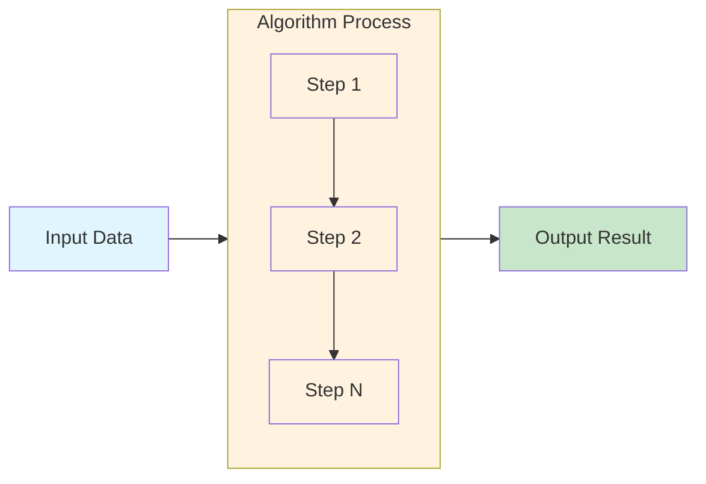
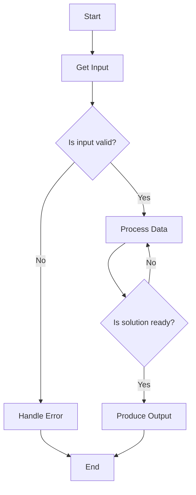
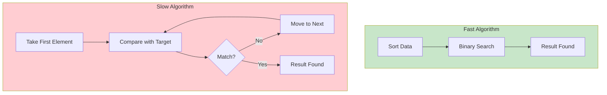
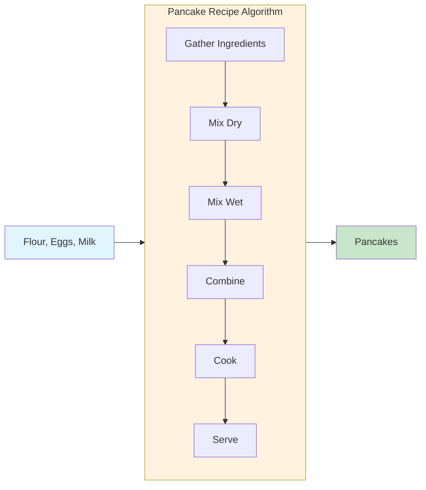

# 📘 Algorithm Analysis

## Topic: What is an Algorithm?

### Introduction

Imagine you're following a recipe to bake a cake. You have a list of ingredients and a step-by-step procedure: preheat the oven, mix flour and sugar, add eggs, bake for 30 minutes. This recipe is essentially an **algorithm** for making a cake.

In computer science, an algorithm is the same concept - a step-by-step procedure for solving a specific problem. Whether you're sorting a list of names, finding the shortest route on Google Maps, or training a Machine Learning model, you're using algorithms.

**Why do programmers need to understand algorithms?**
- **Efficiency:** A good algorithm can solve a problem in seconds; a bad one might take years
- **Scalability:** As data grows (millions of users, billions of records), algorithm choice becomes critical
- **Problem-solving:** Algorithms provide systematic approaches to break down complex problems
- **Performance:** In ML, the algorithm you choose affects model training speed and accuracy

Think of algorithms as the "recipes" that make modern technology work - from your smartphone's face unlock to Netflix's movie recommendations.

---

## 1. Introduction

### Why Was This Concept Created?

Before computers existed, humans needed systematic ways to solve problems. Ancient mathematicians like Euclid (around 300 BCE) developed algorithms for finding greatest common divisors. The word "algorithm" actually comes from the name of the Persian mathematician **Al-Khwarizmi**, who wrote about step-by-step procedures for solving equations in the 9th century.

The fundamental problem algorithms solve is: **"How do we tell a machine exactly what to do, step by step?"**

### What Problem Does It Solve?

Consider these scenarios:

1. **Sorting 1,000,000 customer records**: A human could sort these, but it would take months. An algorithm does it in seconds.
2. **Finding the shortest path between two cities**: There might be millions of route combinations. An algorithm finds the optimal one efficiently.
3. **Detecting spam emails**: An algorithm analyzes patterns across billions of emails to classify new ones.

Algorithms solve the problem of **complexity** - they give us predictable, repeatable ways to handle tasks that would be impossible manually.

### Real-World Motivation

| Industry | Problem | Algorithm Solution |
|----------|---------|-------------------|
| Amazon | Recommend products | Recommendation algorithms |
| Google | Find relevant web pages | PageRank algorithm |
| Uber | Match riders with drivers | Matching algorithms |
| Spotify | Suggest new songs | Collaborative filtering algorithms |
| Self-driving cars | Navigate roads | Path planning algorithms |

### Where Are Algorithms Used in Software Engineering?

- **Web Development:** Routing requests, caching data, searching databases
- **Game Development:** Pathfinding for characters, collision detection
- **Mobile Apps:** Image processing, location services, push notifications
- **Data Engineering:** Processing large datasets, ETL pipelines
- **DevOps:** Load balancing, resource allocation, deployment strategies

---

## 2. Build Intuition

### Real-Life Analogies

**Analogy 1: The Treasure Hunt**

Imagine you're looking for treasure in a large forest. You have a map with an "X" marking the spot. How do you find it?

- **Brute force approach:** Walk through every tree in the entire forest (slow, might take days)
- **Smart approach:** Use the map to navigate: "Head east until you reach the river, then north to the big rock, then west 100 steps" (fast, systematic)

The second approach is an algorithm - a step-by-step plan to reach your goal.

**Analogy 2: Making Pancakes**

A pancake recipe is a perfect analogy:

1. Gather ingredients (inputs)
2. Mix dry ingredients
3. Mix wet ingredients
4. Combine both
5. Cook on pan
6. Serve (output)

The recipe is:
- **Deterministic** (same steps each time)
- **Finite** (has an end)
- **Clear** (no ambiguity)

**Analogy 3: Organizing Books in a Library**

When you return a book, a librarian doesn't search through every shelf to find where to place it. Instead:

1. Check the book's call number
2. Compare with shelf labels
3. Navigate to the correct section
4. Place it in the correct spot

This is an algorithm - and libraries have optimized it over centuries!

### How to Think About Algorithms

Think of an algorithm as answering three questions:

1. **What is the input?** (What do we start with?)
2. **What is the output?** (What do we want to produce?)
3. **What are the steps?** (How do we transform input to output?)

```
Input → [Algorithm] → Output
```

### Why Does This Concept Work?

Algorithms work because:
- They break complex problems into simple, repeatable steps
- They provide **guarantees** (if you follow the steps, you'll get the result)
- They can be **automated** (computers execute them perfectly every time)

### Common Misconceptions

| Misconception | Reality |
|---------------|---------|
| "An algorithm is code" | An algorithm is the logic; code is the implementation |
| "All algorithms are complex" | Simple algorithms (like "find the maximum number in a list") are also algorithms |
| "There's only one way to solve a problem" | There are often many algorithms for the same problem, each with different trade-offs |
| "Algorithms work 100% of the time" | Some algorithms are probabilistic (e.g., recommendation systems) |

### Where Beginners Usually Get Confused

1. **Thinking algorithm = programming language**: An algorithm is language-independent. The same algorithm can be written in Python, Java, C++, etc.

2. **Not considering multiple solutions**: For sorting [3, 1, 4, 2], there are dozens of valid algorithms (bubble sort, merge sort, quick sort, etc.)

3. **Ignoring efficiency**: "It works" isn't enough - we care about how fast it works and how much memory it uses

4. **Missing the "finite" requirement**: An algorithm must end. An infinite loop is not an algorithm.

---

## 3. Core Theory

### Definition

An **algorithm** is a finite sequence of well-defined, unambiguous instructions that:

1. Takes an input (or set of inputs)
2. Performs a specific set of operations
3. Produces an output (or set of outputs)
4. Terminates after a finite number of steps

### Step-by-Step Explanation

#### Step 1: Problem Understanding
Before writing an algorithm, you must understand the problem:
- What's the goal?
- What are we working with?
- What constraints exist?

#### Step 2: Input Specification
Define exactly what data the algorithm receives:
- Type (number, string, list, etc.)
- Format (how is it structured?)
- Range (minimum and maximum values)

#### Step 3: Output Specification
Define exactly what the algorithm produces:
- What should the result be?
- What format should it use?

#### Step 4: Instruction Design
Write the step-by-step instructions:
- Each instruction must be unambiguous
- The order of execution must be clear
- Logic flow (if-else, loops) must be defined

#### Step 5: Termination Condition
Specify when the algorithm stops:
- When a result is found
- When all data is processed
- When a condition is met

### Technical Explanation

#### Formal Definition

An algorithm can be formally defined as a **5-tuple**:

```
Algorithm = (Input, Output, Finiteness, Definiteness, Effectiveness)
```

| Property | Meaning | Example |
|----------|---------|---------|
| **Input** | Zero or more inputs | A list of numbers to sort |
| **Output** | At least one output | The sorted list |
| **Finiteness** | Must terminate after finite steps | Not an infinite loop |
| **Definiteness** | Each step must be precise | "Add 2 to x" not "Add some number to x" |
| **Effectiveness** | Each step must be feasible | "Sort the list" must be broken down |

#### Types of Algorithms

Algorithms can be categorized in many ways:

**By Implementation Style:**
- **Iterative:** Uses loops (for, while)
- **Recursive:** Function calls itself
- **Divide & Conquer:** Breaks problem into smaller subproblems

**By Problem Type:**
- **Search:** Finding an element (e.g., binary search)
- **Sort:** Arranging elements (e.g., merge sort)
- **Optimization:** Finding the best solution (e.g., gradient descent)
- **Transformation:** Converting one form to another (e.g., encryption)

**By Determinism:**
- **Deterministic:** Same input always gives same output
- **Probabilistic:** May use randomness, could give different outputs

### Mathematical Intuition

#### Cost Model

Algorithms consume resources:
- **Time:** Number of operations performed
- **Space:** Amount of memory used

We measure these with **asymptotic notation** (introduced in the next chapter):

```
Time Complexity = Number of operations as a function of input size n
Space Complexity = Memory used as a function of input size n
```

#### Example: Counting Steps

For an algorithm that adds all numbers from 1 to n:

```python
def sum_1_to_n(n):
    total = 0          # 1 operation
    for i in range(n): # n iterations
        total += i     # 1 operation per iteration
    return total       # 1 operation
```

Total operations = 1 + n + 1 = n + 2

As n grows, the constant terms matter less, so this algorithm has **linear complexity** (O(n)).

#### Important Observations

1. **The algorithm is separate from the implementation:** Multiple valid implementations of the same algorithm exist.

2. **Correctness is crucial:** An algorithm must produce the correct output for all valid inputs.

3. **Efficiency matters:** Among correct algorithms, we often choose the most efficient one.

4. **Trade-offs exist:** A faster algorithm might use more memory, and vice versa.

---

## 4. Visual Learning

### Diagram 1: Algorithm as a Transformation



**How to read:** This diagram shows that an algorithm takes an input, processes it through a sequence of steps, and produces an output. The steps are executed in order.

### Diagram 2: Algorithm Decision Flow



**How to read:** This diagram shows an algorithm with branching logic. It starts, gets input, checks validity, processes (possibly repeatedly), and produces output when ready. It's important to see how algorithms can make decisions and repeat steps.

### Diagram 3: Algorithm Comparison



**How to read:** This compares two algorithms solving the same problem (searching in a list). The fast algorithm sorts first (taking some time) then uses a smarter search. The slow algorithm examines each element one by one. For large datasets, the fast algorithm wins dramatically.

### Diagram 4: Recipe Analogy



**How to read:** This diagram shows the recipe analogy. Inputs (ingredients) go into the algorithm (recipe), which processes them through defined steps, producing outputs (pancakes). Each step must be clear and in the right order.

---

## 5. Practical Examples

### Example 1: Finding the Maximum Number

**Problem:** Given a list of numbers, find the largest number.

**Intuition:** Imagine you have a stack of cards with numbers. You look at each card one by one, keeping track of the highest number you've seen so far. At the end, you announce the highest number.

**Why this example:** It's the simplest algorithm most beginners learn. It introduces the concept of processing data sequentially.

**Step-by-Step Solution:**

1. Start with the first number as the "current maximum"
2. For each remaining number:
   - If this number is greater than the current maximum
   - Update the current maximum to this number
3. Return the current maximum

**Pseudocode:**
```
Algorithm: FindMax
Input: List of numbers A
Output: Maximum value in A

1. max = A[0]
2. For i = 1 to length(A)-1:
3.     if A[i] > max:
4.         max = A[i]
5. Return max
```

**Implementation:**

```python
def find_max(numbers):
    """
    Find the maximum number in a list.
    
    Args:
        numbers: List of numbers
        
    Returns:
        Maximum value in the list
    
    Example:
        >>> find_max([3, 7, 2, 9, 5])
        9
    """
    # Step 1: Assume first element is the maximum
    max_value = numbers[0]
    
    # Step 2: Iterate through remaining elements
    for i in range(1, len(numbers)):
        # Step 3: If current number is larger, update max
        if numbers[i] > max_value:
            max_value = numbers[i]
    
    # Step 4: Return the maximum
    return max_value

# Test the function
test_numbers = [3, 7, 2, 9, 5]
result = find_max(test_numbers)
print(f"Maximum of {test_numbers} is: {result}")  # Output: 9
```

**Detailed Execution:**

| Step | Current Max | Number | Action |
|------|-------------|--------|--------|
| Start | - | - | - |
| 1 | 3 | 3 | Initialize max = 3 |
| 2 | 3 | 7 | 7 > 3, max = 7 |
| 3 | 7 | 2 | 2 > 7? No |
| 4 | 7 | 9 | 9 > 7, max = 9 |
| 5 | 9 | 5 | 5 > 9? No |
| End | 9 | - | Return 9 |

**Time Complexity:** O(n) - we visit each element exactly once  
**Space Complexity:** O(1) - we only store the max value

---

### Example 2: Checking if a Number is Prime

**Problem:** Determine if a number is prime (divisible only by 1 and itself).

**Intuition:** To check if a number is prime, we need to see if any number from 2 to n-1 divides it evenly. If we find any divisor, it's not prime.

**Why this example:** It introduces decision-making and optimization (we can stop early).

**Step-by-Step Solution:**

1. If number <= 1, it's not prime
2. For each divisor from 2 to sqrt(n):
   - If n is divisible by divisor, return False (not prime)
3. If no divisor found, return True (prime)

**Implementation:**

```python
import math

def is_prime(n):
    """
    Check if a number is prime.
    
    Args:
        n: Integer to check
        
    Returns:
        True if prime, False otherwise
    
    Example:
        >>> is_prime(7)
        True
        >>> is_prime(12)
        False
    """
    # Numbers <= 1 are not prime
    if n <= 1:
        return False
    
    # Check from 2 to sqrt(n)
    # We only need to check up to sqrt(n) because if n has a divisor,
    # one of the divisors will be <= sqrt(n)
    for i in range(2, int(math.sqrt(n)) + 1):
        if n % i == 0:  # n is divisible by i
            return False
    
    return True

# Test the function
test_numbers = [2, 3, 4, 5, 7, 11, 17, 20, 27, 29]
for num in test_numbers:
    result = is_prime(num)
    print(f"{num} is prime? {result}")

# Output:
# 2 is prime? True
# 3 is prime? True
# 4 is prime? False
# 5 is prime? True
# 7 is prime? True
# 11 is prime? True
# 17 is prime? True
# 20 is prime? False
# 27 is prime? False
# 29 is prime? True
```

**Optimization Explanation:**
We only check up to sqrt(n) because if n = a * b where a <= b, then a <= sqrt(n). For example, if n = 36:
- 36 = 6 × 6 (check up to 6)
- If we check 2, we also catch 18 (2 × 18 = 36)
- If we check 3, we also catch 12 (3 × 12 = 36)

**Time Complexity:** O(√n) - we check up to sqrt(n) divisors  
**Space Complexity:** O(1) - constant space

---

### Example 3: Sum of Two Numbers

**Problem:** Given two numbers, return their sum.

**Intuition:** This is the simplest operation - just add the numbers.

**Why this example:** It demonstrates the most basic algorithm and shows that not all algorithms are complex.

**Step-by-Step Solution:**

1. Receive two numbers as input
2. Add them together
3. Return the sum

**Implementation:**

```python
def add_two_numbers(a, b):
    """
    Add two numbers.
    
    Args:
        a: First number
        b: Second number
        
    Returns:
        Sum of a and b
        
    Example:
        >>> add_two_numbers(5, 3)
        8
    """
    return a + b

# Test the function
num1 = 5
num2 = 3
result = add_two_numbers(num1, num2)
print(f"{num1} + {num2} = {result}")  # Output: 5 + 3 = 8
```

**Time Complexity:** O(1) - constant time, always takes the same number of operations  
**Space Complexity:** O(1) - constant space

---

### Example 4: Counting Vowels in a String

**Problem:** Given a string, count how many vowels (a, e, i, o, u) it contains.

**Intuition:** We examine each character in the string one by one and check if it's a vowel, counting when we find one.

**Why this example:** Shows string processing, a common real-world task.

**Step-by-Step Solution:**

1. Initialize a counter to 0
2. Convert the string to lowercase for consistent checking
3. For each character in the string:
   - If character is in the set of vowels, increment counter
4. Return the counter

**Implementation:**

```python
def count_vowels(text):
    """
    Count the number of vowels in a string.
    
    Args:
        text: String to analyze
        
    Returns:
        Number of vowels in the string
        
    Example:
        >>> count_vowels("Hello World")
        3  # e, o, o
    """
    vowels = set('aeiou')
    count = 0
    
    # Convert to lowercase and iterate through each character
    for char in text.lower():
        if char in vowels:
            count += 1
    
    return count

# Test the function
test_strings = ["Hello", "Python", "Algorithm", "AEIOU", "xyz"]
for text in test_strings:
    result = count_vowels(text)
    print(f"'{text}' has {result} vowel(s)")

# Output:
# 'Hello' has 2 vowel(s)
# 'Python' has 1 vowel(s)
# 'Algorithm' has 3 vowel(s)
# 'AEIOU' has 5 vowel(s)
# 'xyz' has 0 vowel(s)
```

**Time Complexity:** O(n) - we process each character once  
**Space Complexity:** O(1) - constant space (the vowels set is fixed)

---

### Example 5: Reversing a List

**Problem:** Given a list, reverse its elements.

**Intuition:** We want the first element to become last, the second to become second-last, etc. We can do this by swapping elements from both ends.

**Why this example:** Shows in-place manipulation and two-pointer technique.

**Step-by-Step Solution:**

1. Set two pointers: left at index 0, right at index n-1
2. While left < right:
   - Swap elements at left and right
   - Move left forward by 1
   - Move right backward by 1
3. Return the reversed list

**Implementation:**

```python
def reverse_list(arr):
    """
    Reverse a list in-place.
    
    Args:
        arr: List to reverse
        
    Returns:
        Reversed list (same list object)
        
    Example:
        >>> reverse_list([1, 2, 3, 4, 5])
        [5, 4, 3, 2, 1]
    """
    # Initialize two pointers
    left = 0
    right = len(arr) - 1
    
    # Swap elements until pointers meet
    while left < right:
        # Swap elements at left and right
        arr[left], arr[right] = arr[right], arr[left]
        
        # Move pointers toward each other
        left += 1
        right -= 1
    
    return arr

# Test the function
test_list = [1, 2, 3, 4, 5]
print(f"Original: {test_list}")
result = reverse_list(test_list)
print(f"Reversed: {result}")

# Another test with string characters (as list)
char_list = ['a', 'b', 'c', 'd', 'e']
print(f"Original: {char_list}")
reverse_list(char_list)
print(f"Reversed: {char_list}")

# Output:
# Original: [1, 2, 3, 4, 5]
# Reversed: [5, 4, 3, 2, 1]
# Original: ['a', 'b', 'c', 'd', 'e']
# Reversed: ['e', 'd', 'c', 'b', 'a']
```

**Step-by-step execution for [1, 2, 3, 4, 5]:**

| Step | left | right | Action | Array |
|------|------|-------|--------|-------|
| 0 | 0 | 4 | Initial | [1, 2, 3, 4, 5] |
| 1 | 0 | 4 | Swap 1 ↔ 5 | [5, 2, 3, 4, 1] |
| 2 | 1 | 3 | Swap 2 ↔ 4 | [5, 4, 3, 2, 1] |
| 3 | 2 | 2 | left ≥ right, stop | [5, 4, 3, 2, 1] |

**Time Complexity:** O(n/2) = O(n) - we visit half the elements, swapping pairs  
**Space Complexity:** O(1) - in-place reversal, no extra arrays

---

## 6. Machine Learning & Production Connection

### How Algorithms Are Used in Machine Learning

Algorithms are the **core of Machine Learning**. Every ML model is essentially an algorithm that learns patterns from data.

#### 1. Data Preprocessing Algorithms

Before training any ML model, data must be cleaned and transformed:

```python
# Example: Data normalization algorithm
def normalize_data(data):
    """
    Normalize data to [0, 1] range.
    
    This is an algorithm that transforms features to a common scale.
    Used in: Gradient descent, neural networks, distance-based models.
    
    Args:
        data: List of numbers
        
    Returns:
        Normalized list
    """
    min_val = min(data)
    max_val = max(data)
    if max_val == min_val:
        return [0.0] * len(data)
    
    return [(x - min_val) / (max_val - min_val) for x in data]

# Example usage in ML
heights = [160, 170, 180, 190, 165, 175]
normalized_heights = normalize_data(heights)
print(f"Original heights: {heights}")
print(f"Normalized heights: {normalized_heights}")
```

**Why this matters:** Many algorithms (like neural networks, SVM, KNN) require data to be on similar scales to perform well.

#### 2. Training Algorithms

The training phase itself uses iterative algorithms:

- **Gradient Descent:** The algorithm that updates model weights to minimize loss
- **Backpropagation:** The algorithm that computes gradients in neural networks
- **Decision Trees:** Recursive algorithms that split data based on features

**Example: Simple Gradient Descent Algorithm for Linear Regression**

```python
def gradient_descent_linear_regression(X, y, learning_rate=0.01, epochs=1000):
    """
    Train a linear regression model using gradient descent.
    
    This is an iterative optimization algorithm that:
    1. Makes predictions using current parameters
    2. Calculates error (loss)
    3. Updates parameters to reduce error
    4. Repeats until convergence
    
    Args:
        X: Feature matrix
        y: Target values
        learning_rate: Step size for updates
        epochs: Number of iterations
        
    Returns:
        Model parameters (weights and bias)
    """
    import numpy as np
    
    # Initialize parameters
    m = len(y)
    weights = np.zeros(X.shape[1])
    bias = 0
    
    # Iterative training loop
    for epoch in range(epochs):
        # Forward pass: make predictions
        predictions = np.dot(X, weights) + bias
        
        # Calculate loss (Mean Squared Error)
        loss = (1/(2*m)) * np.sum((predictions - y) ** 2)
        
        # Backward pass: calculate gradients
        d_weights = (1/m) * np.dot(X.T, (predictions - y))
        d_bias = (1/m) * np.sum(predictions - y)
        
        # Update parameters
        weights -= learning_rate * d_weights
        bias -= learning_rate * d_bias
        
        # Print loss every 100 epochs
        if epoch % 100 == 0:
            print(f"Epoch {epoch}, Loss: {loss:.4f}")
    
    return weights, bias

# Example usage
X = np.array([[1, 2], [2, 3], [3, 4], [4, 5]])
y = np.array([3, 5, 7, 9])
weights, bias = gradient_descent_linear_regression(X, y)
print(f"Learned weights: {weights}")
print(f"Learned bias: {bias}")
```

**Key insight:** The gradient descent algorithm is what enables ML models to "learn" from data.

#### 3. Inference Algorithms

After training, the model uses algorithms to make predictions:

```python
def predict_linear_regression(X, weights, bias):
    """
    Make predictions using trained linear regression model.
    
    This is a simple inference algorithm that:
    1. Takes input features
    2. Applies the learned linear equation
    3. Returns predictions
    
    Args:
        X: Input features
        weights: Learned weights
        bias: Learned bias
        
    Returns:
        Predictions
    """
    return np.dot(X, weights) + bias

# Example usage
new_data = np.array([[5, 6], [6, 7]])
predictions = predict_linear_regression(new_data, weights, bias)
print(f"Predictions for new data: {predictions}")
```

### Where Algorithms Appear in PyTorch, TensorFlow, NumPy

#### NumPy
```python
import numpy as np

# NumPy algorithms
arr = np.array([3, 1, 4, 1, 5, 9, 2, 6])

# Sorting algorithm (implemented in C for speed)
sorted_arr = np.sort(arr)  # Uses quicksort or mergesort

# Searching algorithms
max_value = np.max(arr)  # Finds maximum (linear scan)
indices = np.where(arr > 3)  # Conditional search

# Statistical algorithms
mean = np.mean(arr)  # Sum all elements, divide by count
std = np.std(arr)    # Standard deviation calculation
```

#### PyTorch
```python
import torch

# PyTorch tensors and algorithms
tensor = torch.tensor([1.0, 2.0, 3.0, 4.0])

# Neural network operations
x = torch.randn(5, 10)  # Random input
weights = torch.randn(10, 1)  # Random weights

# Matrix multiplication algorithm (optimized)
output = torch.mm(x, weights)  # Uses BLAS algorithms

# Activation functions (specific algorithms)
relu_output = torch.relu(output)  # ReLU algorithm
```

#### TensorFlow/Keras
```python
import tensorflow as tf

# TensorFlow uses optimized algorithms for:
model = tf.keras.Sequential([
    tf.keras.layers.Dense(128, activation='relu'),
    tf.keras.layers.Dense(10, activation='softmax')
])

# Compile uses optimization algorithms
model.compile(
    optimizer='adam',  # Adaptive Moment Estimation algorithm
    loss='categorical_crossentropy'
)

# Training uses the backpropagation algorithm
model.fit(x_train, y_train, epochs=10, batch_size=32)
```

### Production Systems Examples

#### 1. Google Search
- **Crawling:** Algorithm to systematically explore the web
- **Indexing:** Algorithms to organize billions of web pages
- **Ranking:** PageRank algorithm and hundreds of others for relevance
- **Query processing:** Natural language understanding algorithms

#### 2. Amazon Recommendation
- **Collaborative filtering:** Algorithm to find similar users/items
- **Matrix factorization:** Algorithms to decompose user-item interactions
- **Real-time scoring:** Algorithms to rank recommendations per user

#### 3. Netflix Recommendation
- **Content-based filtering:** Algorithm to recommend similar content
- **Matrix factorization:** SVD algorithms for implicit feedback
- **Contextual bandits:** Algorithms to explore vs. exploit

#### 4. Uber Routing
- **Dijkstra's algorithm:** Shortest path in road networks
- **Vehicle routing:** Algorithms for dispatch optimization
- **ETA prediction:** ML algorithms for arrival time estimation

### Scalability Considerations

**Challenge 1: Big Data**
- Algorithms must handle terabytes/petabytes of data
- Solutions: MapReduce algorithms, distributed computing

**Challenge 2: Real-time Requirements**
- Recommendations must be generated in milliseconds
- Solutions: Pre-computation, caching, approximate algorithms

**Challenge 3: Cost Optimization**
- Cloud computing costs money
- Solutions: Optimize algorithms to use less CPU/GPU

**Example: Production ML Pipeline**
```python
class ProductionMLPipeline:
    """
    A production ML pipeline showing algorithm orchestration.
    """
    
    def __init__(self):
        self.scaler = None  # Normalization algorithm
        self.model = None   # Training algorithm
        self.cache = {}     # Caching algorithm
    
    def preprocess(self, data):
        # Data cleaning algorithm
        cleaned = self.remove_outliers(data)
        
        # Feature engineering algorithm
        features = self.extract_features(cleaned)
        
        # Normalization algorithm
        normalized = self.normalize(features)
        
        return normalized
    
    def predict(self, input_data):
        # Check cache first
        cache_key = hash(str(input_data))
        if cache_key in self.cache:
            return self.cache[cache_key]  # Return cached result
        
        # Inference algorithm
        result = self.model.predict(input_data)
        
        # Cache result for future requests
        self.cache[cache_key] = result
        
        return result
```

---

## 7. Practice Problems

### Problem 1: Sum of All Numbers in a List
- **Difficulty:** Easy
- **Main Concept:** Iteration, accumulation
- **Problem:** Given a list of numbers, find their sum.
- **Expected Time Complexity:** O(n)
- **Expected Space Complexity:** O(1)
- **Link:** [GeeksforGeeks - Sum of array](https://www.geeksforgeeks.org/program-find-sum-elements-given-array/)

### Problem 2: Linear Search
- **Difficulty:** Easy
- **Main Concept:** Sequential search, iteration
- **Problem:** Given a list and a target value, find if the target exists in the list. Return the index if found, otherwise -1.
- **Expected Time Complexity:** O(n)
- **Expected Space Complexity:** O(1)
- **Link:** [LeetCode 35 - Search Insert Position](https://leetcode.com/problems/search-insert-position/)

### Problem 3: Find the Smallest Number
- **Difficulty:** Easy
- **Main Concept:** Find minimum
- **Problem:** Given a list of numbers, find the smallest number.
- **Expected Time Complexity:** O(n)
- **Expected Space Complexity:** O(1)
- **Link:** [GeeksforGeeks - Find Minimum Element](https://www.geeksforgeeks.org/python-program-to-find-smallest-number-in-a-list/)

### Problem 4: Character Frequency Counter
- **Difficulty:** Easy/Medium
- **Main Concept:** Frequency counting, dictionary/array storage
- **Problem:** Given a string, count the frequency of each character.
- **Expected Time Complexity:** O(n)
- **Expected Space Complexity:** O(k) where k is number of distinct characters
- **Link:** [LeetCode 383 - Ransom Note](https://leetcode.com/problems/ransom-note/)

### Problem 5: Find the Largest Product of Two Numbers
- **Difficulty:** Medium
- **Main Concept:** Finding max and second max
- **Problem:** Given a list of numbers, find the maximum possible product of any two numbers in the list.
- **Expected Time Complexity:** O(n)
- **Expected Space Complexity:** O(1)
- **Link:** [GeeksforGeeks - Maximum Product of Two Elements](https://www.geeksforgeeks.org/maximum-product-of-two-numbers-in-a-list/)

### Problem 6: Even or Odd Counter
- **Difficulty:** Easy
- **Main Concept:** Conditional logic, counting
- **Problem:** Given a list of numbers, count how many are even and how many are odd.
- **Expected Time Complexity:** O(n)
- **Expected Space Complexity:** O(1)
- **Link:** [GeeksforGeeks - Count Even Odd Numbers](https://www.geeksforgeeks.org/python-program-to-count-even-and-odd-numbers-in-a-list/)

### Problem 7: Palindrome Checker
- **Difficulty:** Easy/Medium
- **Main Concept:** String reversal, two-pointer technique
- **Problem:** Given a string, check if it's a palindrome (reads the same forward and backward).
- **Expected Time Complexity:** O(n)
- **Expected Space Complexity:** O(1)
- **Link:** [LeetCode 125 - Valid Palindrome](https://leetcode.com/problems/valid-palindrome/)

### Problem 8: Compare Two Lists
- **Difficulty:** Easy/Medium
- **Main Concept:** Iteration, comparison
- **Problem:** Given two lists, find the common elements between them.
- **Expected Time Complexity:** O(n + m) where n and m are list sizes
- **Expected Space Complexity:** O(min(n, m))
- **Link:** [LeetCode 349 - Intersection of Two Arrays](https://leetcode.com/problems/intersection-of-two-arrays/)

---

## 8. Interview Preparation

### Common Product Company Questions

**Question 1: "Explain an algorithm you've implemented in a recent project."**

*Sample Answer:*
"In my last project, I implemented a recommendation algorithm for an e-commerce platform. The algorithm analyzed user purchase history and found similar users using Jaccard similarity. Then it recommended products purchased by similar users but not yet purchased by the target user. The algorithm had O(n²) complexity when comparing all users, so I optimized it by using a MinHash approximation to O(n)."

**Question 2: "What's the difference between an algorithm and a heuristic?"**

*Sample Answer:*
"An algorithm guarantees a correct result when followed correctly. For example, binary search always finds the target if it exists. A heuristic is a practical approach that provides a good-enough solution quickly but doesn't guarantee correctness. In routing, Dijkstra's algorithm finds the optimal shortest path, while a heuristic like 'always turn right' might find a path but not the shortest one."

**Question 3: "How would you choose between two algorithms that solve the same problem?"**

*Sample Answer:*
"I'd consider:
1. **Input size:** Different algorithms work better for different sizes
2. **Time constraints:** Does it need to be real-time?
3. **Memory constraints:** How much memory is available?
4. **Data characteristics:** Is the data sorted? Are there duplicates?
5. **Implementation cost:** Is simplicity important?
6. **Scalability:** Will the input size grow?"

### FAANG Interview Questions

**Question 1: "Design an algorithm for a news aggregator that shows users articles they might like."**

*Follow-up questions:*
- How do you handle new users with no history? (Cold start problem)
- How do you ensure variety and avoid filter bubbles?
- How do you handle millions of users and articles?

*Expected approach:*
```
Algorithm Flow:
1. Feature extraction: Extract features from articles (topics, keywords, author, popularity)
2. User profiling: Build user profile based on reading history
3. Candidate generation: Find articles likely to interest the user
   - Collaborative filtering: Users with similar reading patterns
   - Content-based: Similar to articles user has liked
4. Ranking: Score candidates using ML model
5. Diversity adjustment: Ensure variety in recommendations
6. Real-time updates: Update as user interacts
```

**Question 2: "What algorithm would you use for spell checking in a search engine?"**

*Follow-up questions:*
- How do you handle typos?
- How do you suggest corrections quickly?
- How do you handle millions of queries per second?

*Expected approach:*
```
Algorithm Structure:
1. Pre-processing: Build a dictionary of valid words
2. For each query:
   a. Check if word exists in dictionary
   b. If not, generate candidates (Levenshtein distance, phonetic matching)
   c. Rank candidates by similarity and frequency
   d. Return top suggestions
3. Optimization: Use a Trie data structure for O(k) lookup where k is word length
```

**Question 3: "How would you implement an autocomplete system?"**

*Expected approach:*
```
Algorithm Design:
1. Data structure: Trie for prefix matching
2. Add: Insert words with frequency
3. Query: Find node for prefix, traverse children to find top k words
4. Frequency updates: Increment count for used words

Optimization:
- Use compressed trie (radix tree) for memory efficiency
- Cache frequent queries
- Use approximate matching for typos
- Bias toward more recent queries
```

### Common Mistakes Candidates Make

1. **Not clarifying input/output first**
   - Always ask: "What is the input size? Is it sorted? Are there duplicates?"
   
2. **Jumping to code too quickly**
   - Start with algorithm design, pseudocode, then code

3. **Not considering edge cases**
   - Empty inputs, single element, all same elements, negative numbers

4. **Ignoring time/space complexity in discussion**
   - Always mention the trade-offs

5. **Not explaining the "why"**
   - "I chose this algorithm because..." (mention trade-offs)

### Optimization Discussions

**Optimization 1: From O(n²) to O(n)**
```python
# Brute force: Find pairs with sum = target
# O(n²)
def find_pairs_brute(arr, target):
    pairs = []
    for i in range(len(arr)):
        for j in range(i+1, len(arr)):
            if arr[i] + arr[j] == target:
                pairs.append((arr[i], arr[j]))
    return pairs

# Optimized: Use a set for O(1) lookup
# O(n)
def find_pairs_optimized(arr, target):
    seen = set()
    pairs = []
    for num in arr:
        complement = target - num
        if complement in seen:
            pairs.append((complement, num))
        seen.add(num)
    return pairs
```

**Optimization 2: From O(n) to O(log n)**
```python
# Linear search
def search_linear(arr, target):
    for i, num in enumerate(arr):
        if num == target:
            return i
    return -1

# Binary search (requires sorted array)
def search_binary(arr, target):
    left, right = 0, len(arr) - 1
    while left <= right:
        mid = (left + right) // 2
        if arr[mid] == target:
            return mid
        elif arr[mid] < target:
            left = mid + 1
        else:
            right = mid - 1
    return -1
```

### Interview Tips

1. **Clarify the problem** - Don't assume anything
2. **Think out loud** - Show your thought process
3. **Start simple** - Get a working solution first
4. **Optimize after** - The first solution doesn't have to be optimal
5. **Test your code** - Walk through a few examples
6. **Discuss trade-offs** - Show you understand the bigger picture
7. **Time/Space complexity** - Always mention them

---

## 9. Key Takeaways

### What We Learned

1. **Definition:** An algorithm is a finite sequence of well-defined instructions to solve a specific problem

2. **Properties:**
   - Must have input and output
   - Must be finite (terminate)
   - Must be definite (unambiguous)
   - Must be effective (feasible)

3. **Classification:**
   - Iterative vs. Recursive
   - Search vs. Sort vs. Optimization vs. Transformation
   - Deterministic vs. Probabilistic

### Important Concepts

| Concept | Meaning | Example |
|---------|---------|---------|
| Input | Data the algorithm receives | List of numbers to sort |
| Output | Result produced by the algorithm | Sorted list |
| Finiteness | Must terminate after finite steps | Not an infinite loop |
| Definiteness | Each step is unambiguous | "Add 2" not "Add some number" |
| Correctness | Produces correct output for all valid inputs | Sorting returns sorted list |

### Important Formulas (for Complexity Analysis)

| Algorithm Type | Time Complexity | Space Complexity |
|---------------|-----------------|------------------|
| Constant time | O(1) | O(1) |
| Linear search | O(n) | O(1) |
| Binary search | O(log n) | O(1) |
| Bubble sort | O(n²) | O(1) |
| Merge sort | O(n log n) | O(n) |

### Complexity Summary

| Operation | Time Complexity |
|-----------|-----------------|
| Find max in array | O(n) |
| Check if palindrome | O(n) |
| Sum of array | O(n) |
| Simple arithmetic | O(1) |
| Check if prime | O(√n) |
| Reverse array | O(n) |

### Best Practices

1. **Start with the algorithm, not the code**
   - Write pseudocode first, then translate to programming language

2. **Consider edge cases**
   - Empty inputs, negative values, large numbers, duplicates

3. **Document your algorithm**
   - Explain the approach, complexity, and assumptions

4. **Test thoroughly**
   - Test with small inputs first, then larger ones

5. **Optimize based on constraints**
   - Different algorithms for different constraints

### Interview Revision Points

**Quick Check: Do You Understand?**
- [ ] Can you define an algorithm?
- [ ] Can you list the five properties of an algorithm?
- [ ] Can you give three real-world examples of algorithms?
- [ ] Can you distinguish between correct and efficient algorithms?
- [ ] Can you describe how algorithms are used in ML?
- [ ] Can you analyze a simple algorithm's time complexity?

**Common Interview Questions to Practice:**
- "Explain an algorithm like I'm 5 years old."
- "What's the difference between an algorithm and a program?"
- "How would you improve [specific algorithm]?"
- "When would you use [algorithm A] over [algorithm B]?"

### Production Engineering Insights

1. **Algorithm choice impacts business metrics**
   - A 10% improvement in recommendation algorithm = millions in revenue
   - A faster search algorithm = better user experience

2. **Scalability is critical**
   - A working algorithm for 1000 items might not work for 1 billion
   - Need algorithms that can distribute across machines

3. **Real-world constraints often override theoretical optimality**
   - Sometimes simpler is better (faster, easier to maintain)
   - Some problems require approximate solutions, not exact ones

4. **Monitoring algorithms in production is essential**
   - Track performance metrics (latency, throughput)
   - Monitor correctness (fallback to simpler algorithms if needed)

### Final Thoughts

Every algorithm you learn is a tool in your engineering toolkit. Understanding algorithms helps you:
- **Think systematically** about problems
- **Choose the right tool** for the job
- **Build scalable systems** that handle real-world data
- **Create ML models** that learn efficiently from data

Remember: Algorithms are the recipes that make computers work. The more recipes you know, the better you can cook!

---

*"An algorithm must be seen to be believed." - Donald Knuth*