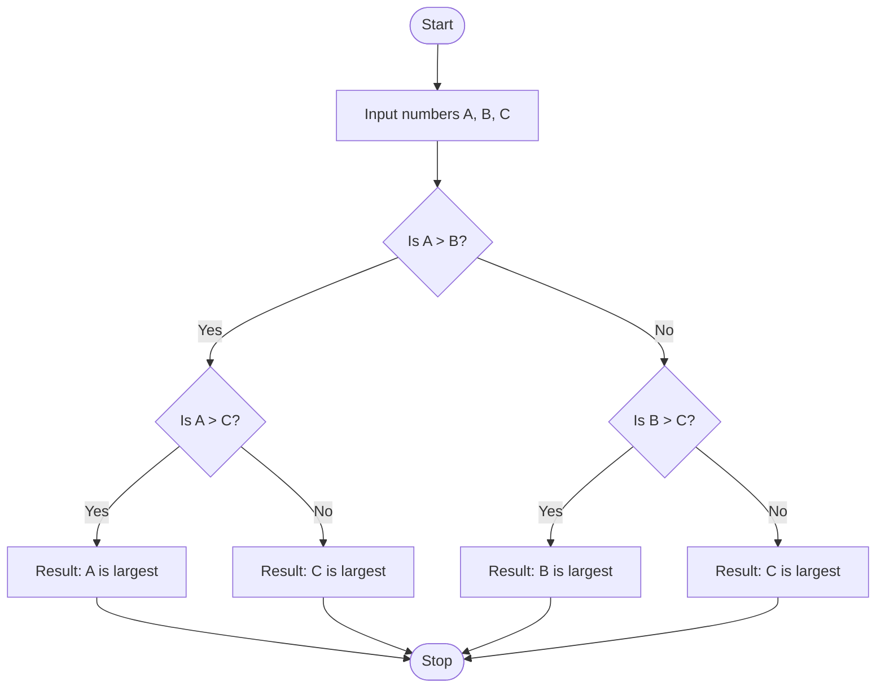

# Algorithm Analysis: What is an Algorithm?

Imagine you want to bake a chocolate cake, assemble a piece of furniture, or find a specific card in a shuffled deck. How do you do it? You follow a sequence of steps. If the steps are vague, out of order, or never-ending, you will never get your cake, your furniture will fall apart, and you will search for that card forever.

In computer science, this sequence of steps is called an **algorithm**. Before we can write code, build artificial intelligence models, or design massive systems like Google or Netflix, we must understand exactly what an algorithm is.

### Why This Topic Exists

Computers are incredibly fast, but they are also fundamentally uncreative. They cannot "figure things out" on their own. They require explicit, unambiguous instructions to solve any problem. Algorithm analysis exists so we can formulate these instructions correctly and evaluate which set of instructions is the best tool for the job.

### Why Programmers Need It

Writing code without understanding algorithms is like trying to build a house without a blueprint. You might jam some bricks together, but the structure will likely collapse under pressure. Understanding algorithms allows you to transition from a coder who merely writes syntax to a software engineer who systematically solves complex problems.

### Why It Is Crucial for Advanced DSA and Machine Learning

Every advanced Data Structure and Algorithm (DSA)—from balancing trees to finding the shortest path on a map—is simply a specialized algorithm. Furthermore, every Machine Learning model (like ChatGPT or self-driving algorithms) is fundamentally composed of mathematical algorithms that learn from data. If you do not understand what makes an algorithm valid and efficient, it is impossible to optimize neural networks or handle large-scale data.

---

# 1. Introduction

Historically, the word *algorithm* comes from the name of the 9th-century Persian mathematician **Muḥammad ibn Mūsā al-Khwārizmī**. He introduced systematic algebraic techniques for solving linear and quadratic equations.

In modern computing, an algorithm was created to solve a fundamental problem: **How do we translate human problem-solving logic into a form that a machine can execute reliably every single time?**

### What Problem It Solves

Consider a simple real-world problem: looking up a word in a physical dictionary.

* If you open the book to random pages hoping to find your word, you might get lucky, or you might search for hours.
* If you read every single word from the first page forward, you will eventually find it, but it will take an immense amount of time.
* If you open to the middle, check if your word comes before or after that page alphabetically, and throw away the half you don't need, you will find it incredibly fast.

An algorithm formalizes the third method into a repeatable process. It eliminates guesswork, randomness, and inefficiency by providing a definitive strategy to solve a problem.

### Real-World Motivation

Every time you interact with technology, you are interacting with algorithms:

* **GPS Navigation:** When you ask Google Maps for directions, an algorithm examines billions of possible routes to find the fastest path to your destination.
* **Social Media Feeds:** Instagram and TikTok use algorithms to analyze your past behavior and decide which video will keep you scrolling next.
* **E-commerce:** Amazon uses sorting algorithms to display products from lowest price to highest price in milliseconds.

---

# 2. Build Intuition

Before looking at formal computer code, let’s build intuition using a daily life scenario: **Making a cup of tea.**

If you were to explain how to make tea to a human, you might say: *"Boil some water, put a tea bag in a cup, pour the water, and add sugar."* A human fills in the gaps using common sense. But a computer has no common sense. If you tell a computer to "pour the water," it might pour it on the floor because you didn't specify to pour it *into the cup*.

An algorithmic thinker views the world as a series of precise, micro-steps. Let's look at how we must structure our thinking:

```
Step 1: Place an empty cup on the counter.
Step 2: Check if there is water in the kettle.
Step 3: If the kettle is empty, fill it with water.
Step 4: Turn on the kettle.
Step 5: Wait until the water boils (reaches 100°C).
Step 6: Place one tea bag inside the cup.
Step 7: Pour the boiling water from the kettle into the cup.
Step 8: Wait for 3 minutes.
Step 9: Remove the tea bag.
Step 10: Stop.

```

### Why This Works

This works because it leaves absolutely no room for interpretation. Every instruction is clear, executes in order, and eventually ends.

### Common Misconceptions & Beginner Confusion

* **Misconception 1: "An algorithm is just programming code."** * *Correction:* An algorithm is independent of any programming language. You can write an algorithm in English (Pseudocode), draw it as a diagram, or write it in Python, Java, or C++. The algorithm is the *idea*; the code is just the *translation*.
* **Misconception 2: "Any set of instructions is an algorithm."**
* *Correction:* If instructions can go on forever without stopping, it is **not** an algorithm. For example: *"Step 1: Take a step forward. Step 2: Repeat Step 1."* This is an infinite loop, not a valid algorithm.


---

# 3. Core Theory

Now let's formalize our intuition into computer science theory.

### Formal Definition of an Algorithm

An **algorithm** is a well-defined, step-by-step computational procedure that takes some value (or set of values) as **input** and produces some value (or set of values) as **output** in a finite amount of time.

### The 5 Essential Properties of a Valid Algorithm

To be considered a true algorithm in computer science, a procedure must satisfy five strict criteria:

| Property | Description | Real-World Meaning |
| --- | --- | --- |
| **1. Input** | Quantities that are externally supplied before the algorithm begins. | It must have zero or more clear starting points. |
| **2. Output** | At least one quantity is produced as a result. | It must actually solve the problem and give you an answer. |
| **3. Definiteness** | Each step must be clear, unambiguous, and precisely defined. | There can be no "maybe" or "choose a random number" unless the rules of selection are explicit. |
| **4. Finiteness** | The algorithm must terminate (stop) after a finite number of steps. | It cannot run in an infinite loop forever. |
| **5. Effectiveness** | Every step must be basic enough that it could, in theory, be done by a person with a pencil and paper. | It must be practically feasible. |

---

# 4. Visual Learning

Let's look at how algorithms process logic visually. We will map out two variations of an algorithm designed to find the largest number among three distinct numbers ($A$, $B$, and $C$).

### Diagram 1: Algorithmic Flowchart

This flowchart shows how a computer evaluates conditions step-by-step to arrive at a single, definitive maximum value.



### How to Read This Diagram

* **Ovals** represent the entry (Start) and exit (Stop) points, ensuring the **Finiteness** property.
* **Parallelograms** represent input and output operations.
* **Diamonds** represent decision points (Definiteness). Depending on whether the condition is true (Yes) or false (No), the execution follows exactly one path.

### What We Learn From It

This diagram proves visually that no matter what numbers you input for $A$, $B$, and $C$, the process will *always* reach a "Stop" state and will *always* output exactly one correct answer.

---

# 5. Practical Examples

Let’s look at how algorithms look in actual Software Engineering practice using Python.

### Example 1: Calculating the Average of Three Numbers

* **Why this example was chosen:** It demonstrates a direct, sequential algorithm with clear inputs, operations, and outputs without complex loops.
* **Intuition:** To find the average, we must first combine (sum) all numbers together, then divide that total weight equally among the count of items (3).

```python
def calculate_average(a, b, c):
    # Step 1: Accumulate the sum of all inputs
    total_sum = a + b + c
    
    # Step 2: Divide by the count of elements to find the average
    average = total_sum / 3
    
    # Step 3: Return the calculated output
    return average

# Testing the algorithm
result = calculate_average(10, 20, 30)
print("The average is:", result)  # Expected Output: 20.0

```

#### Complexity Analysis

* **Time Complexity:** $O(1)$ (Constant Time). The algorithm takes the exact same number of mathematical steps whether the numbers are small or in the billions.
* **Space Complexity:** $O(1)$ (Constant Space). No extra memory scales with the input size; we only store a couple of fixed variables (`total_sum` and `average`).

---

### Example 2: Finding the Maximum Number in a List

* **Why this example was chosen:** It introduces the concept of iteration (looping through data) and maintaining a "state" (memory of the current highest value).
* **Intuition:** Imagine looking at a sequence of cards one by one. You hold the highest card you've seen so far in your left hand. Every time you see a card higher than the one in your hand, you replace it.

```python
def find_maximum(numbers):
    # Edge case: If the list is empty, return None
    if not numbers:
        return None
    
    # Step 1: Assume the first number is the largest initially
    current_max = numbers[0]
    
    # Step 2: Scan through the rest of the numbers in the list
    for num in numbers:
        # Step 3: If we find a number larger than our current max, update it
        if num > current_max:
            current_max = num
            
    # Step 4: Return the ultimate largest value found
    return current_max

# Testing the algorithm
my_list = [4, 12, 7, 21, 18]
print("The maximum is:", find_maximum(my_list))  # Expected Output: 21

```

#### Complexity Analysis

* **Time Complexity:** $O(n)$, where $n$ is the number of elements in the list. The algorithm must look at each item exactly once to guarantee it has found the true maximum.
* **Space Complexity:** $O(1)$ (Constant Space). We are only tracking one single variable (`current_max`), regardless of whether the list contains 5 items or 5 million items.

---

# 6. Machine Learning & Production Connection

Algorithms are the bedrock of industry scale. Let's see how this introductory concept maps directly to massive corporate ecosystems and Artificial Intelligence.

### Production Scale: The Search Engine (Google)

When you type a query into Google, a **Searching Algorithm** scans an index of billions of web pages. If Google used a naive algorithm that looked through pages one-by-one sequentially, your search would take days. Google uses advanced indexing and retrieval algorithms to reduce this search time to microseconds.

### Machine Learning: Linear Regression & Gradient Descent

In Machine Learning, a model learns patterns from data using an optimization algorithm. For instance, **Gradient Descent** is a step-by-step mathematical algorithm that calculates the errors a model makes, adjusts its internal parameters by a microscopic amount, and repeats this process until the errors are minimized.

Without the mathematical guarantee of **finiteness** and **definiteness** in optimization algorithms, neural networks like OpenAI's GPT models would never converge; they would loop indefinitely without ever learning how to generate human-like text.

---

# 7. Practice Problems

To solidify your understanding of what constitutes a valid, step-by-step algorithm, try implementing solutions to these fundamental challenges:

### 1. Count Even Numbers

* **Difficulty:** Easy
* **Main Concept Practiced:** Sequential traversal and conditional processing properties.
* **Expected Time Complexity:** $O(n)$
* **Expected Space Complexity:** $O(1)$
* **Practice Platform:** [LeetCode - Find Numbers with Even Number of Digits](https://leetcode.com/problems/find-numbers-with-even-number-of-digits/) *(A similar structural variant of element counting)*

### 2. FizzBuzz Problem

* **Difficulty:** Easy
* **Main Concept Practiced:** Definiteness and ordering of logical steps (handling multiple conditions without ambiguity).
* **Expected Time Complexity:** $O(n)$
* **Expected Space Complexity:** $O(1)$
* **Practice Platform:** [LeetCode - Fizz Buzz](https://leetcode.com/problems/fizz-buzz/)

---

# 8. Interview Preparation

In technical interviews at companies like Apple, Google, or Meta, interviewers don't just look for working code; they evaluate your algorithmic baseline.

### Common Interview Questions on this Topic

1. *"What makes a sequence of instructions an algorithm versus just a script?"*
2. *"Can you identify an infinite loop scenario and explain which property of algorithms it violates?"*
3. *"Why is it critical to handle edge cases (like empty inputs) when designing an algorithm?"*

### Top Candidate Pitfall: Ignoring Edge Cases

When asked to write an algorithm, a weak candidate immediately begins writing code for the generic scenario. An expert candidate pauses and clarifies the boundaries:

* *What if the input list is empty?*
* *What if the numbers contain negative values?*

> **Interview Tip:** Always validate the **Input property** of your algorithm before performing operations. If your algorithm crashes on an empty input, it fails the property of **Definiteness**.

---

# 9. Key Takeaways

### What We Learned

* An **algorithm** is a precise, language-independent blueprint for solving a specific computational problem.
* Code is merely an implementation tool; the algorithm itself is the underlying logical process.
* Algorithms must meet five strict rules: Input, Output, Definiteness, Finiteness, and Effectiveness.

### Core Frameworks for Quick Revision

* **Finiteness Check:** Always ensure your loops have an explicit, reachable exit condition.
* **Definiteness Check:** Ensure conditional pathways (`if/else` statements) clearly handle all possible scenarios without ambiguity.
* **Efficiency Focus:** The goal of algorithm design is minimizing both the clock steps (**Time Complexity**) and the memory footprint (**Space Complexity**).

> *"An algorithm must be seen to be believed."* *~ Donald Knuth*