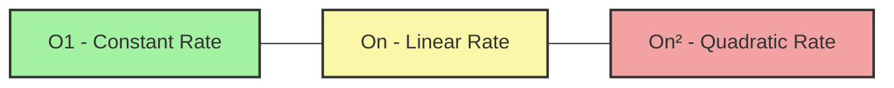

# Why Algorithm Analysis Matters

Imagine you are a structural engineer tasked with building a bridge. You wouldn't just throw steel and concrete together, cross your fingers, and hope it holds. You would calculate the exact load the bridge can sustain, how it will perform during an earthquake, and how much it will cost to build.

In computer science, **Algorithm Analysis** is that structural engineering phase. It is the mathematical and logical evaluation of how well an algorithm will perform *before* you deploy it to production.

---

# 1. Introduction

When computers were first invented, hardware was incredibly limited. Memory was measured in kilobytes, and processors were painfully slow. In that era, efficiency wasn’t just a preference—it was a requirement for survival.

Today, we have supercomputers in our pockets, but algorithm analysis matters more than ever. Why? Because the size of our **data** has exploded exponentially.

### The Core Problem It Solves

If you have a small dataset—say, a list of 10 usernames—any correct algorithm will feel instantaneous. A messy, poorly written algorithm and a brilliant, highly optimized algorithm will both finish in a fraction of a millisecond.

But what happens when your user base grows to 10 million?

* A bad algorithm might take **days** to process the data, paralyzing your business.
* A well-analyzed, optimized algorithm will handle it in **seconds**.

Algorithm analysis allows us to predict how an algorithm will scale as the input size grows, without needing to spend thousands of dollars running it on real servers just to find out.

---

# 2. Build Intuition

Let’s step out of the tech world to understand how performance scales.

Imagine you are a teacher grading exam papers. You have two different methods (algorithms) to check if any student cheated by copying answers from someone else:

* **Method A (The Naive Way):** You take the first student's paper and manually compare it against every other student's paper. Then you take the second paper and compare it against all others, and so on.
* **Method B (The Clever Way):** You sort the papers by the exact final score first. Since students who copied likely have the exact same score, you only compare papers that end up next to each other in the sorted stack.

If you only have **3 students**, Method A requires a few comparisons. Method B might actually take longer because sorting takes extra effort.

But what if you are grading a standardized national exam with **100,000 students**?
Method A will require roughly $10,000,000,000$ (10 billion) individual comparisons. If each takes one second, you will be grading for over 300 years. Method B, however, can be finished in a few days.

### The Growth Curve

This is the core intuition of algorithm analysis: **It’s not about how fast an algorithm runs for small inputs; it’s about how the runtime explodes as the input grows.**

### Common Misconceptions

* **"Can't we just buy faster hardware?"** Beginners often think, *"If my code is slow, I'll just run it on a faster AWS server or a newer MacBook."* This is a massive trap. If an algorithm scales exponentially, upgrading to a computer that is 10 times faster will barely make a dent. A fundamentally flawed algorithm will easily crush the fastest supercomputer on Earth.
* **"The stop-watch method is enough."** Measuring performance by literally timing code execution with a clock (called profiling) is unreliable. It changes based on the programming language used, whether your laptop is plugged into power, or what other background apps are open. Analysis gives us a universal language that is independent of hardware.

---

# 3. Core Theory

To analyze algorithms universally, computer scientists look at two main resources: **Time** and **Space**.

### 1. Time Complexity

Time complexity is **not** the measurement of actual time (seconds). Instead, it is the measurement of **how the number of basic operations grows relative to the input size ($n$).**

* If an algorithm processes a list of size $n$ by looking at each item exactly once, its time scales linearly ($O(n)$).
* If it uses a nested loop to compare every item to every other item, its time scales quadratically ($O(n^2)$).

### 2. Space Complexity

An algorithm doesn't just need time; it needs memory to hold its variables, arrays, and data structures. Space complexity measures **how much extra memory the algorithm requires as the input size grows.**

* If your algorithm creates a brand-new copy of a list for every item added to it, your memory usage will spiral out of control at scale.

### The Trade-Off Principle

In production software engineering, you will rarely find an algorithm that is perfectly optimal in both time and space. Algorithm analysis exposes the **Time-Space Trade-Off**: you can often make an algorithm run faster by using more memory, or conserve memory by allowing the algorithm to run slower. Analysis helps you choose the right balance for your specific system.

---

# 4. Visual Learning

Let's look at how different algorithmic growth rates separate from each other as data scales up.

### Diagram: The Big-O Scale Matrix

This chart visualizes how execution steps skyrocket for inefficient algorithms compared to efficient ones as the input volume increases.



### What We Learn From It

* **Green Zone ($O(1)$):** Performance stays perfectly flat. This is highly sustainable.
* **Yellow Zone ($O(n)$):** Performance tracks smoothly alongside input size. Highly predictable and acceptable for most production pipelines.
* **Red Zone ($O(n^2)$):** Performance degrades rapidly. A small bump in data creates a massive wall of latency.

---

# 5. Practical Examples

Let’s look at two distinct ways to solve the exact same problem: finding out if a list contains duplicate values.

### Approach 1: The Naive Search (No Analysis Mindset)

* **Intuition:** Take each element and check it against every single element ahead of it using nested loops.
* **Why it's chosen:** It's the most instinctive way a beginner writes code.

```python
def has_duplicates_naive(arr):
    n = len(arr)
    # Loop through every element
    for i in range(n):
        # Compare it to every subsequent element
        for j in range(i + 1, n):
            if arr[i] == arr[j]:
                return True # Duplicate found
    return False

```

#### Complexity Analysis

* **Time Complexity:** $O(n^2)$ (Quadratic Time). For 10,000 elements, this will trigger roughly 50,000,000 internal comparisons.
* **Space Complexity:** $O(1)$ (Constant Space). It uses no extra memory structures.

---

### Approach 2: The Optimized Search (Analyzed Mindset)

* **Intuition:** We trade a little bit of memory space to gain a massive boost in speed by tracking elements we've seen inside a lookup Set.

```python
def has_duplicates_optimized(arr):
    seen = set()
    # Loop through the array exactly once
    for num in arr:
        if num in seen:
            return True # Duplicate found instantly
        seen.add(num)
    return False

```

#### Complexity Analysis

* **Time Complexity:** $O(n)$ (Linear Time). For 10,000 elements, it loops exactly 10,000 times. It is thousands of times faster than Approach 1.
* **Space Complexity:** $O(n)$ (Linear Space). In the worst-case scenario where there are no duplicates, the `seen` set grows to store a copy of all $n$ elements in memory.

---

# 6. Machine Learning & Production Connection

### Large Language Models (LLMs) & Transformers

The absolute core of modern AI (including models like ChatGPT) relies on a mechanism called **Self-Attention**.
Historically, standard self-attention has an algorithmic complexity of $O(n^2)$, where $n$ is the number of words (tokens) in a prompt.

Because of this quadratic time complexity, if you double the length of the text you paste into an AI, the processing cost and compute time quadruple! This is exactly why AI labs invest billions of dollars into algorithm analysis—engineering new "sparse attention" algorithms to bring that complexity down so models can process entire books or movies at a fraction of the cost.

### Enterprise Scale: Netflix Stream Allocation

When millions of users simultaneously hit "Play" on a video, Netflix must route traffic across servers globally. A poorly analyzed routing algorithm could cause server overloads or buffering. Using graph analysis optimization guarantees that stream delivery paths are allocated dynamically in near constant-time.

---

# 7. Practice Problems

To practice identifying how variations in code layout shift complexity properties, study and write basic loops for these structural variations:

### 1. Element Print Skips

* **Difficulty:** Easy
* **Main Concept Practiced:** Identifying code loops that increment by multiplication or variable jumps instead of a single step.
* **Expected Time Complexity:** $O(\log n)$ or $O(n)$ depending on implementation.
* **Practice Platform:** [GeeksforGeeks - Analysis of Algorithms](https://www.geeksforgeeks.org/practice-questions-time-complexity-analysis/)

---

# 8. Interview Preparation

In a world-class tech interview, the moment you provide a solution, the interviewer will almost certainly ask: **"What is the time and space complexity of your approach, and can we optimize it?"**

### Top Candidate Pitfall: Premature Optimization Without Analysis

Candidates often start guessing random data structures ("Maybe a Hash Map will fix it?") without actually analyzing *where* the bottleneck in their code lies.

> **Interview Tip:** When presented with a problem, don't write code immediately. State the naive brute-force approach first, explicitly mention its runtime analysis (e.g., *"This would take $O(n^2)$ time"*), and use that analysis as your leverage to explain *why* a more optimized approach is needed.

---

# 9. Key Takeaways

### What We Learned

* **Hardware cannot rescue bad code:** Inefficient algorithms scale worse than any computer hardware can keep up with.
* **Performance is defined by growth trend lines:** Algorithm analysis evaluates how execution steps evolve as input size stretches to infinity.
* **Decisions imply trade-offs:** Optimizing code speed often requires giving up memory footprints, and vice-versa.

### Complexity Reference Cheat Sheet

* **$O(1)$ (Constant):** Ideal. Code doesn’t slow down regardless of scale.
* **$O(n)$ (Linear):** Great. Growth matches input volume symmetrically.
* **$O(n^2)$ (Quadratic):** High Risk. Fine for small setups, dangerous for big data production pipelines.

> *"Smart data structures and dumb code works a lot better than the other way around."* *~ Eric S. Raymond*