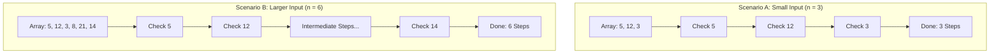

# Algorithm Analysis: Input Size ($n$)

In our previous chapters, we established that algorithm analysis measures how an algorithm scales as things get larger. But what exactly is growing?

When computer scientists talk about growth, they measure it relative to a variable called **Input Size**, universally denoted as **$n$**.

### Why This Topic Exists

To judge how efficient an algorithm is, we need a standard unit of measurement. We cannot use seconds because hardware varies, and we cannot use lines of code because different languages write things differently. Input Size ($n$) provides a universal, mathematical baseline that represents the **volume of the problem** we are asking the computer to solve.

### Why Programmers Need It

As a developer, your code will process different types of data: arrays, database strings, image pixels, or network packets. By defining your problem's size as $n$, you can mathematically predict exactly how your system's performance will change when traffic spikes.

### Why It Is Important Before Learning Advanced DSA and Machine Learning

Before you can calculate Big-O complexities (like $O(n)$, $O(n^2)$, or $O(\log n)$), you must first identify what $n$ actually represents in your specific scenario. If you misidentify $n$, your entire performance analysis will be incorrect.

---

# 1. Introduction

The concept of Input Size was standardized to decouple software performance from hardware capabilities. It shifts our focus from *"How fast does this program run on an Intel i9 processor?"* to *"How many fundamental pieces of data must this algorithm manipulate?"*

### What Problem It Solves

Consider an algorithm designed to blur a digital image. If you run it on a small profile picture, it finishes instantly. If you run it on a billboard-sized photo, your computer fans start spinning loudly.

The algorithm didn't change—the **input size** did. By formalizing this size as $n$, we establish a direct mathematical relationship between the volume of data and the computational effort required to process it.

### Where It Is Used in Software Engineering

* **Database Queries:** $n$ might represent the total number of customer records stored in a database table.
* **Network Routing:** $n$ could be the number of data packets traveling through a router per second.
* **Compilers:** When you build code, $n$ is the number of lines of source code the compiler has to parse.

---

# 2. Build Intuition

Let’s step out of the digital world to understand how $n$ changes depending on the context of the task.

Imagine you are hired to organize a messy warehouse. The amount of work you have to do depends entirely on your input size ($n$). However, how you define $n$ changes based on your assignment:

* **Task 1: Count the Boxes.** If your job is simply to count every box in the warehouse, $n$ is the **total number of boxes**. If there are 100 boxes, $n = 100$. Your work scales directly with the number of boxes.
* **Task 2: Sort Boxes by Weight.** If your job is to arrange the boxes from lightest to heaviest, you have to compare boxes against each other. Here, $n$ is still the number of boxes, but your workload will grow much faster than it did for a simple count.
* **Task 3: Search within a Box.** What if you are given just *one* massive wooden crate full of thousands of tiny loose screws, and you need to find a specific gold screw? Now, the number of boxes doesn't matter (the box count is just 1). Instead, $n$ becomes the **total number of items inside that single box**.

### Common Misconceptions & Beginner Confusion

* **Confusion: "Is $n$ always an array length?"** * *Correction:* No. While $n$ is very frequently the length of a list or array in beginner coding problems, it can represent entirely different metrics depending on the problem. For instance, if you are calculating the factorial of a single number (like $5!$), $n$ is the **numeric value of the integer itself**, not the size of a collection.

---

# 3. Core Theory

Formally, the **Input Size ($n$)** is defined as the total number of basic elements, bits, or records that must be read and processed to compute an answer.

### How $n$ Maps to Common Data Structures

Because data comes in many shapes, $n$ adapts to fit the structure being evaluated:

| Data Structure Type | What $n$ Represents | Example Scenario |
| --- | --- | --- |
| **Linear Arrays / Lists** | The number of elements in the collection. | Searching for a specific name in a list of usernames. |
| **Strings / Text** | The total number of characters. | Checking if a password contains a special character. |
| **Matrices / 2D Arrays** | The total dimensions ($R \times C$) or total cells. | Image processing where $n = \text{Width} \times \text{Height}$ (total pixels). |
| **Graphs / Networks** | Split into two variables: Vertices ($V$) and Edges ($E$). | Map navigation where $V = \text{Cities}$ and $E = \text{Highways}$. |

### The Bit Complexity Distinction

In advanced theoretical computer science, $n$ is sometimes strictly defined as the **number of bits** required to represent the input in binary on a machine. For example, the number 8 requires 4 bits to store (`1000`). For standard algorithm analysis, however, we generally treat $n$ at the macro-level (number of integers, characters, or objects) to keep our evaluations practical and readable.

---

# 4. Visual Learning

Let's look at how the exact same algorithm handles execution paths visually as its input size shifts from a small value to a larger value.

### Diagram: Input Scaling Execution Paths

This process diagram illustrates how a simple array filtering algorithm scales its internal operations as the problem volume ($n$) expands.



### What We Learn From It

When $n = 3$, the engine executes a brief sequence of operations. When $n$ doubles to $6$, the loop logic doesn't change, but the processing path naturally stretches out to mirror the size of $n$. The algorithm's structural complexity remains constant, while its workload tracks $n$ directly.

---

# 5. Practical Examples

Let’s see how $n$ changes in code environments depending on whether we are dealing with a simple list, a string, or a matrix grid.

### Example 1: Standard Linear Input ($n = \text{Length of List}$)

* **Why this example was chosen:** It shows the most common variant where $n$ scales cleanly with array elements.

```python
def print_all_items(items):
    # Here, 'n' is explicitly the number of elements inside 'items'
    n = len(items) 
    
    for i in range(n):
        print(items[i])

```

* **Input Size Context:** If `items = [10, 20, 30]`, then $n = 3$. The loop runs 3 times.

---

### Example 2: Text String Processing ($n = \text{Character Count}$)

* **Why this example was chosen:** It demonstrates that even when no numeric array is passed, a string acts as a sequential collection of size $n$.

```python
def count_vowels(text):
    # Here, 'n' is the number of individual characters in the text string
    n = len(text)
    vowel_count = 0
    
    for i in range(n):
        if text[i].lower() in 'aeiou':
            vowel_count += 1
            
    return vowel_count

```

* **Input Size Context:** If `text = "Hello"`, then $n = 5$. If `text` is a whole book chapter, $n$ could be 50,000.

---

### Example 3: Matrix/Grid Inputs ($n = \text{Total Pixels/Cells}$)

* **Why this example was chosen:** It highlights a scenario where there are two dimensions, and performance scales with their product.

```python
def invert_image_colors(matrix):
    rows = len(matrix)
    cols = len(matrix[0]) if rows > 0 else 0
    
    # The true input size 'n' is the total number of cells: rows * cols
    for r in range(rows):
        for c in range(cols):
            matrix[r][c] = 255 - matrix[r][c] # Invert pixel color

```

* **Input Size Context:** For a grid of size $10 \times 10$, the engine processes $100$ cells. Here, our growth analysis is typically measured against the combined space footprint $R \times C$.

---

# 6. Machine Learning & Production Connection

### Input Size in Deep Learning (Batch Size and Tokens)

In Machine Learning, tracking input size is a core task for memory management on graphics cards (GPUs).

* When training Large Language Models, input size is calculated as the **Context Window Token Length ($n$)**.
* If you prompt an AI with a massive 100,000-word document, $n = 100,000$. Because of how memory scales relative to token input sizes, processing a document that large requires specialized, high-memory server clusters to keep the system from throwing an "Out of Memory" crash.

---

# 7. Practice Problems

To test your ability to correctly identify $n$, review these conceptual situations:

### 1. Multi-String Concatenation

* **Difficulty:** Easy
* **Main Concept Practiced:** Determining if $n$ represents the number of words or the sum of characters when merging strings together.
* **Practice Link:** [LeetCode - Defanging an IP Address](https://leetcode.com/problems/defanging-an-ip-address/) *(Observe how the input size is strictly constrained by string character elements).*

---

# 8. Interview Preparation

### Top Candidate Pitfall: Misstating $n$ for Multiple Inputs

A common trap interviewers set is giving you an algorithm that takes **two distinct lists** as inputs (e.g., an array of users and an array of permissions) and asking for the time complexity.

Inexperienced candidates will instinctively say: *"The time complexity is $O(n^2)$."*
The interviewer will immediately ask: *"What is $n$?"*

If the two arrays are completely different sizes, you cannot use a single variable $n$. You must state the complexities using separate variables (e.g., $O(A \times B)$, where $A$ is the size of the first list and $B$ is the size of the second list).

> **Interview Tip:** Whenever you mention the letter "$n$" during a technical evaluation, explicitly clarify what it represents to show deep structural intuition. Say: *"Assuming $n$ represents the total number of nodes in our tree..."*

---

# 9. Key Takeaways

### What We Learned

* **Input Size ($n$)** is the universal baseline metric used to represent the quantity of data an algorithm must process.
* It abstracts away variables like clock speed, programming syntax variations, and operating system overhead.
* $n$ seamlessly takes on different meanings—array lengths, string lengths, total grid cells, or network nodes—depending on the underlying data structure.

### Quick Revision Framework

* When looking at a single loop traversing a list, $n = \text{list length}$.
* When inspecting an image processing algorithm, $n = \text{width} \times \text{height}$.
* Always verify whether a multi-variable scenario requires tracking separate parameters (like $n$ and $m$).

> *"First, express the problem in terms of its size."* *~ Unknown Computer Science Proverb*