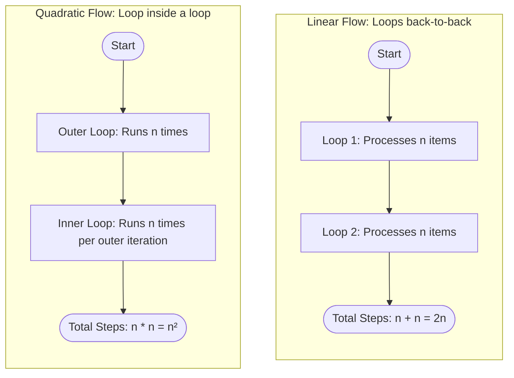

# Algorithm Analysis: Time Complexity

In the previous chapters, we defined our input size as $n$. We also established that we cannot measure an algorithm’s speed in seconds because hardware variations would distort the results.

So, how do we measure an algorithm's efficiency in a way that remains true on a 10-year-old laptop, a modern smartphone, or a massive cloud supercomputer? We use **Time Complexity**.

### Why This Topic Exists

Time complexity provides a mathematically rigorous way to describe the speed of an algorithm. It allows us to compare two different approaches to the same problem and definitively prove which one is better, completely independent of the hardware, operating system, or programming language used to run it.

### Why Programmers Need It

As a programmer, writing code that works on your local machine is only half the battle. When your software scales to production, inefficient code can cause server crashes, high cloud bills, and a terrible user experience. Time complexity gives you the ability to predict the future performance of your code before a single user ever interacts with it.

### Why It Is Important Before Learning Advanced DSA and Machine Learning

Every data structure (like Hash Maps, Trees, or Graphs) and every algorithm (like QuickSort or Dijkstra's) is chosen specifically because of its time complexity characteristics. In Machine Learning, time complexity dictates whether a model can train in a few hours or if it will take millions of years to converge.

---

# 1. Introduction

The concept of time complexity was developed to treat software performance as an inherent property of the *logic* itself, rather than a property of the *machine* executing it.

### What Problem It Solves

If you write a program and run it on a slow computer, it runs slowly. If you run the exact same program on a faster computer, it runs faster. This tells us nothing about how well the program was actually designed.

Time complexity shifts our focus away from **physical wall-clock time** and places it on **growth rate**. It solves the problem of hardware bias by counting the number of *primitive computational steps* an algorithm executes as a function of the input size $n$.

### Where It Is Used in Software Engineering

* **Code Reviews:** Senior engineers analyze the time complexity of a pull request to ensure a new feature won't degrade production system performance.
* **API Design:** When designing endpoints that handle data, time complexity helps determine if pagination (breaking data into pages) is required.
* **System Architecture:** Choosing between a relational database or a key-value store often comes down to the time complexity of their read and write operations.

---

# 2. Build Intuition

Let's use a real-world analogy to understand how time complexity works conceptually.

Imagine you need to send a large digital file (like a 100 GB video) to a friend who lives across town. You have two different "algorithms" to accomplish this:

* **Algorithm 1 (The Internet Transfer):** You upload the file to a cloud drive, and your friend downloads it.
* **Algorithm 2 (The Physical Drive):** You copy the file onto a physical USB drive, hop on a bicycle, and pedal over to your friend's house to hand it to them.

Which algorithm is faster? It depends entirely on the size of the file ($n$).

If the file is a tiny 1 MB document, uploading and downloading it takes a split second. Riding a bicycle across town would be absurdly slow.

But what if the file size $n$ grows to 10 Terabytes?

* **The Internet Transfer** scale line shoots straight up. Uploading 10 TB over a standard internet connection could take days or weeks. The time required scales directly with the file size.
* **The Physical Drive** scale line stays completely flat. Whether the USB drive holds 1 MB or 10 TB, it takes the exact same amount of time to pedal across town. The file size does not change your biking speed.

### How to Think About This

In computer science terms:

* The Internet Transfer has a **Linear Time Complexity**. As the data grows, the time grows proportionally.
* The Physical Drive has a **Constant Time Complexity**. No matter how much data you throw at it, the operational time remains fixed.

### Common Misconceptions & Beginner Confusion

* **Misconception: "Time complexity tells me the exact number of milliseconds my code takes."** * *Correction:* It does not. It only tells you the *shape of the curve* that the running time traces as the input grows. It answers the question: *If I double the input size, what happens to the execution steps? Do they double? Do they quadruple? Or do they stay the same?*
* **Confusion: "My code has 10 lines, so it takes 10 steps."**
* *Correction:* A single line of code inside a loop that runs $n$ times will execute $n$ times. Lines of code do not equal execution steps.


---

# 3. Core Theory

Let's look at how we formalize this mathematically. To analyze an algorithm's time complexity, we break down the execution into **Primitive Operations**.

### Primitive Operations

A primitive operation is a basic instruction that a computer's processor can execute in a single, fixed block of time. Examples include:

* Assigning a value to a variable (`x = 5`)
* Performing a basic arithmetic operation (`y = x + 2`)
* Comparing two values (`if x > y`)
* Returning a value from a function (`return total`)

### Step-by-Step Analysis Example

Let's mathematically count the exact number of primitive operations executed by this simple Python function:

```python
def calculate_total(arr):
    total = 0                 # 1 operation: Assignment
    n = len(arr)              # 1 operation: Assignment
    
    for i in range(n):        # Loop runs 'n' times
        total += arr[i]       # 2 operations per loop: Array lookup + Addition
        
    return total              # 1 operation: Return

```

Let's total these up:

* The setup steps run exactly **2 times** (assigning `total` and `n`).
* The code inside the loop runs exactly **$n$ times**. Inside, we have an array indexing step (`arr[i]`) and an addition/assignment step (`+=`). That evaluates to $2n$ operations.
* The loop management itself (incrementing `i` and checking if `i < n`) also runs roughly $2n$ times.
* The return step runs exactly **1 time**.

Putting it all together into a mathematical function $T(n)$ that represents the total primitive steps:


$$T(n) = 4n + 3$$

### The Principle of Asymptotic Growth

If our array size $n$ is small, say $n = 5$, then $T(5) = 4(5) + 3 = 23$ operations. The constant number `3` matters a bit here.

But what if $n$ scales to **1,000,000,000** (one billion)?


$$T(1,000,000,000) = 4(1,000,000,000) + 3 = 4,000,000,003$$

Notice that the constant `3` becomes completely insignificant. Even the multiplier coefficient `4` loses its descriptive value relative to the sheer size of $n$. The dominating factor that dictates how this algorithm behaves at scale is simply $n$ itself.

Therefore, when analyzing time complexity, we drop all lower-order terms and constant coefficients. We isolate the single dominant term. This process is called **Asymptotic Analysis**, and it leads directly into Big-O Notation, which we will formally cover in the next chapter. For now, we express this growth rate as **Linear Time**.

---

# 4. Visual Learning

Let's look at a structural visualization of how execution steps branch and stack depending on how your code loops are configured.

### Diagram: Execution Step Formations

This structural breakdown demonstrates how code architecture fundamentally changes the footprint of execution steps.



### What We Learn From This Diagram

* **In a sequential architecture**, the execution blocks add together ($n + n = 2n$). When we drop the constant coefficient, this retains a clean **Linear** footprint.
* **In a nested architecture**, for every single step the outer loop takes, the inner loop must run to completion. This causes the operations to multiply ($n \times n = n^2$), creating an entirely different, highly dangerous **Quadratic** trend line at scale.

---

# 5. Practical Examples

Let’s look at three classic code structural archetypes to observe their time complexities.

### Example 1: Constant Time

* **Intuition:** The code looks at a fixed, precise location. It does not matter if the input array holds 5 items or 5,000,000 items; the operation takes a single step.

```python
def get_first_element(arr):
    # Validates input size properties safely
    if len(arr) == 0:
        return None
        
    return arr[0] # Single primitive step

```

* **Time Complexity Analysis:** Constant Growth. The processing time line remains perfectly flat across any input volume.

---

### Example 2: Linear Time

* **Intuition:** A single loop walks cleanly from the beginning of a collection to the end, spending a uniform amount of operational energy on each item.

```python
def find_item_index(arr, target):
    for i in range(len(arr)):
        if arr[i] == target:
            return i # Found target item
            
    return -1 # Target item not present

```

* **Time Complexity Analysis:** Linear Growth. In the worst-case scenario where the target item is at the very end of the list (or missing entirely), the execution steps match the length of the list $n$.

---

### Example 3: Quadratic Time

* **Intuition:** The algorithm compares every item in a list to every other item in that same list, creating a cross-multiplied execution matrix.

```python
def print_all_pairs(arr):
    n = len(arr)
    # Outer loop runs n times
    for i in range(n):
        # Inner loop runs n times for every single outer step
        for j in range(n):
            print(arr[i], arr[j])

```

* **Time Complexity Analysis:** Quadratic Growth. If $n = 10$, this prints $10 \times 10 = 100$ pairs. If $n = 1,000$, it shoots up to $1,000 \times 1,000 = 1,000,000$ operations.

---

# 6. Machine Learning & Production Connection

Time complexity analysis forms the basis of infrastructural budgeting at technology giants.

### Real-World Production Failures: The Cloud Cost Spike

Consider an engineering team at an e-commerce platform like Amazon processing an incoming list of transaction logs.

* If an engineer ships a processing script containing a hidden nested loop running at a quadratic time complexity ($n^2$), the system might pass staging checks smoothly when tested with 1,000 records.
* However, when deployed to production where it processes 1,000,000 live transaction logs, the step volume scales from $1,000,000$ operations to $1,000,000,000,000$ (one trillion) operations.

The server's CPU usage instantly pins at 100%, services grind to a halt, auto-scaling scripts spin up hundreds of emergency cloud instances to handle the load, and the company is hit with a massive server invoice—all because of an unvetted time complexity bottleneck.

---

# 7. Practice Problems

Analyze the code pathways of these real structural exercises to determine how their operation tracking scales:

### 1. Two Independent Loops

* **Difficulty:** Easy
* **Core Concept:** Distinguishing between sequential addition and nested multiplication loops.
* **Problem Link:** [LeetCode - Number of Good Pairs](https://leetcode.com/problems/number-of-good-pairs/) *(Analyze the brute force nested index loops before looking up optimized strategies).*

---

# 8. Interview Preparation

### Common Follow-up Questions in Technical Screenings

* *"You've given me an $O(n^2)$ solution for this search. What is the explicit structural bottleneck that causes this runtime, and what data structure can we trade to reduce the time complexity to linear?"*
* *"How does your time complexity change if the input array is already guaranteed to be completely sorted?"*

> **Interview Tip:** Always state your time complexity using the phrase **"in the worst-case scenario."** This shows the interviewer that you don't just memorize shorthand notations; you understand that an algorithm's performance can change depending on the state of the incoming data.

---

# 9. Key Takeaways

### What We Learned

* **Time complexity** measures how the count of primitive execution steps grows relative to the input size $n$.
* We drop lower-order terms and constants because they become irrelevant as $n$ approaches infinity (**Asymptotic Analysis**).
* Sequential loops add together ($n + n = 2n \rightarrow$ Linear Growth), while nested loops multiply ($n \times n = n^2 \rightarrow$ Quadratic Growth).

### Shorthand Complexity Growth Chart

1. **Constant Time:** Flat performance baseline. Scale-resilient.
2. **Linear Time:** Proportional growth. Predictable and highly standard for data passes.
3. **Quadratic Time:** Exponential growth risk. Dangerous at scale; requires optimization attention.

> *"The hidden cost of software is rarely the lines written, but the computational steps executed at scale."* *~ Unknown Systems Architect*