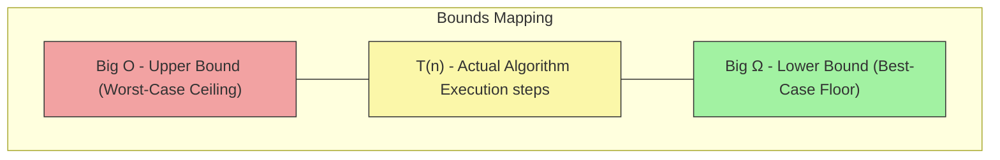

# Algorithm Analysis: Big $\Omega$ (Omega) Notation

In our previous chapter, we mastered **Big O Notation**, which acts as a safety guarantee by providing an **upper bound** (the worst-case scenario) for an algorithm's growth rate.

But worst-case scenarios only tell half the story. What if you want to know the absolute fastest an algorithm can run under the most ideal conditions? Or what if you want to guarantee that a system will *at least* meet a certain baseline performance? To express this **lower bound**, computer scientists use **Big $\Omega$ (Omega) Notation**.

### Why This Topic Exists

While Big O prevents your systems from exploding in the worst case, Big $\Omega$ tells you the minimum amount of work an algorithm must perform. It provides a mathematical floor for performance, ensuring that an algorithm can never run faster than its Big $\Omega$ threshold.

### Why Programmers Need It

As an engineer, you don't just design code for data to break down; sometimes you choose an algorithm because it performs extraordinarily well when data is already partially prepared. Big $\Omega$ helps you understand and mathematically prove the **best-case performance** of your systems.

### Why It Is Important Before Learning Advanced DSA and Machine Learning

In advanced DSA, comparing algorithms requires looking at both their ceiling (Big O) and their floor (Big $\Omega$). For example, Insertion Sort and Selection Sort both have a worst-case time complexity of $O(n^2)$. However, if you feed them a list that is *already completely sorted*, Insertion Sort finishes in $\Omega(n)$ steps, while Selection Sort still plods along at $\Omega(n^2)$ steps. Big $\Omega$ reveals these crucial differences.

---

# 1. Introduction

Big $\Omega$ notation was introduced alongside Big O to provide a complete bound on algorithmic behavior.

### What Problem It Solves

If Big O tells us, *"This program will take at most $n^2$ steps,"* it doesn't rule out the possibility that the program might occasionally finish in 1 step if we give it lucky data.

Big $\Omega$ answers the opposite question: *"What is the absolute minimum amount of work this code has to do?"* It establishes a mathematical promise that no matter how perfectly arranged or tiny the incoming data is, the algorithm cannot cheat its way below this baseline level of computational effort.

### Where It Is Used in Software Engineering

* **Algorithm Proofs:** Proving that a specific computational problem (like comparison-based sorting) cannot possibly be solved faster than a certain mathematical limit (e.g., proving sorting is $\Omega(n \log n)$).
* **Performance Benchmarking:** Setting guaranteed minimum throughput rates for data streaming pipelines.

---

# 2. Build Intuition

Let’s use a real-world commute analogy to understand Big $\Omega$ conceptually.

Imagine you are driving home from work, and your normal commute is 15 miles.

* **The Upper Bound (Big O):** If there is terrible construction, a torrential downpour, and a massive traffic jam, it might take you up to 2 hours to get home. This is your worst-case ceiling. You can safely tell your family, *"I will be home in $O(\text{2 hours})$."*
* **The Lower Bound (Big $\Omega$):** What if every single traffic light is green, the roads are completely empty, and you drive at the absolute maximum speed limit? It will still take you at least **15 minutes** to physically traverse that distance. Unless you invent a teleportation device, it is physically impossible to get home in 3 seconds. That 15-minute floor is your **$\Omega(\text{15 minutes})$**.

### Common Misconceptions & Beginner Confusion

* **Misconception: "Big O is for time, and Big $\Omega$ is for space."**
* *Correction:* Both notations can be used to analyze both time and space. Big O is an *upper limit* on either resource, while Big $\Omega$ is a *lower limit* on either resource.


* **Confusion: "Is Big $\Omega$ always just the Best-Case?"**
* *Correction:* While beginners often use Big $\Omega$ strictly to describe the best-case running time of an algorithm, mathematically it just means "lower bound." You can technically describe the lower bound of a worst-case scenario, but in practical software engineering interviews, Big $\Omega$ is almost always used to quantify the **best-case growth rate**.


---

# 3. Core Theory

Let’s look at the mathematical definition of Big $\Omega$ notation.

### Mathematical Definition

Let $T(n)$ be the actual running time of an algorithm expressed as a function of input size $n$. We say that:

$$T(n) = \Omega(g(n))$$

if there exist positive structural constants $c$ and $n_0$ such that:

$$T(n) \ge c \cdot g(n) \quad \text{for all } n \ge n_0$$

### What does this math actually mean?

It means that once the input size gets past a certain baseline point ($n_0$), the function $c \cdot g(n)$ will **always act as an absolute floor**, running completely below or matching the real execution line $T(n)$. The algorithm's real step count will *at least* match or exceed this function.

---

# 4. Visual Learning

Let's look at how the real execution steps of a searching algorithm are bounded by Big O and Big $\Omega$.

### Diagram: The Algorithmic Bounding Box

This process chart visualizes how an algorithm's actual operational runtime fluctuates between its absolute floor (Omega) and ceiling (Big O).



### What We Learn From This Diagram

The actual execution line can curve, wiggle, or drop depending on how "lucky" the incoming data is. However, it is fundamentally trapped inside this bounding box. It can never break through the top ceiling (Big O), and it can never drop below the bottom floor (Big $\Omega$).

---

# 5. Practical Examples

Let’s look at two code examples to see how Big $\Omega$ behaves based on the input data.

### Example 1: Linear Search

* **Intuition:** Scanning an array from left to right looking for a specific target value.

```python
def linear_search(arr, target):
    for i in range(len(arr)):
        if arr[i] == target:
            return i # Target found!
    return -1

```

#### Complexity Analysis:

* **Worst-Case (Big O):** If the target item is at the very end of the array or missing entirely, the loop must execute exactly $n$ times. Therefore, the upper bound is **$O(n)$**.
* **Best-Case (Big $\Omega$):** What if the very first item we look at (`arr[0]`) happens to be our target? The algorithm finds it immediately and exits in a single step, regardless of whether the array has 10 elements or 10 million elements. Therefore, the lower bound is constant: **$\Omega(1)$**.

---

### Example 2: Strict Element Counting

* **Intuition:** An algorithm that calculates the sum of all elements in an array.

```python
def sum_all_elements(arr):
    total = 0
    for num in arr:
        total += num
    return total

```

#### Complexity Analysis:

* **Worst-Case (Big O):** The loop must inspect every single element to calculate the full sum. It takes $n$ steps: **$O(n)$**.
* **Best-Case (Big $\Omega$):** Is there any layout of data that lets this algorithm skip steps? No. Even if the array is already sorted, completely full of zeros, or inverted, the code *must* physically traverse all $n$ items to compute the output. It can never escape doing $n$ work. Therefore, its lower bound is also linear: **$\Omega(n)$**.

---

# 6. Machine Learning & Production Connection

### Best-Case Guarantees in Real-Time Systems

In critical real-time production systems—such as autonomous self-driving car braking systems or algorithmic high-frequency trading platforms—engineers care deeply about both limits.

If a safety sensor's tracking algorithm has a best-case profile of $\Omega(1)$ but a worst-case profile of $O(n^2)$, it introduces a massive variable delay risk. If a sudden spike in sensor data points forces the algorithm into its $O(n^2)$ state, the braking system might take 2 seconds to process instead of 2 milliseconds.

Engineers use analysis to select algorithms where the lower bound ($\Omega$) and upper bound ($O$) are tightly pinched together, ensuring highly predictable performance no matter how chaotic the input data becomes.

---

# 7. Practice Problems

Analyze the best-case execution boundaries of these scenarios:

### 1. Flag-Based Array Break

* **Difficulty:** Easy
* **Core Concept:** Spotting early exit conditions that allow an algorithm to finish in constant time under perfect data setups.
* **Problem Link:** [LeetCode - Check if All Characters Have Equal Number of Occurrences](https://leetcode.com/problems/check-if-all-characters-have-equal-number-of-occurrences/) *(Determine the absolute minimum number of string lookups required if an early exit criteria is triggered immediately).*

---

# 8. Interview Preparation

### Common Interview Questions on this Topic

* *"What is the difference between Big O and Big $\Omega$ notation?"*
* *"Can you give me an example of an algorithm whose worst-case time complexity is mathematically identical to its best-case time complexity?"* *(Hint: Look at Example 2 above!)*

> **Interview Tip:** If an interviewer asks you to provide the complexity of a solution, always clarify which bound you are talking about. Saying, *"The algorithm runs in $O(n)$ time, but it has an optimal lower bound of $\Omega(1)$ if the target element is positioned at the start,"* shows a world-class level of precision.

---

# 9. Key Takeaways

### What We Learned

* **Big $\Omega$ Notation** provides an asymptotic **lower bound** representing the absolute minimum growth rate of an algorithm (typically evaluating the best-case scenario).
* It creates a performance floor; an algorithm can never run faster than its Big $\Omega$ boundary at scale.
* Some algorithms have highly volatile boundaries (e.g., Linear Search: $O(n)$ vs $\Omega(1)$), while others are completely rigid (e.g., Sum Elements: $O(n)$ vs $\Omega(n)$).

### Quick Boundary Summary Cheat Sheet

| Algorithm Type | Worst-Case Ceiling (Big O) | Best-Case Floor (Big $\Omega$) |
| --- | --- | --- |
| **Linear Search** | $O(n)$ | $\Omega(1)$ |
| **Summing an Array** | $O(n)$ | $\Omega(n)$ |
| **Nested Loop Pair Printing** | $O(n^2)$ | $\Omega(n^2)$ |

> *"If you don't know the absolute floor of your algorithm's performance, you don't truly understand the physics of your code."* *~ Unknown Systems Engineer*