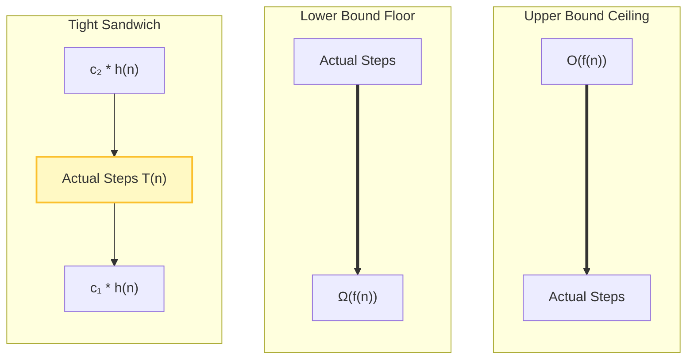

# Algorithm Analysis: Big $\Theta$ (Theta) Notation

We have covered the upper boundary of performance using **Big O Notation** (the worst-case ceiling) and the lower boundary using **Big $\Omega$ Notation** (the best-case floor).

But what happens when an algorithm's floor and ceiling are exactly the same? What if an algorithm performs the exact same way regardless of whether the incoming data is messy, perfectly sorted, or completely random? To express this exact, tight boundary, computer scientists use **Big $\Theta$ (Theta) Notation**.

### Why This Topic Exists

In software engineering, predictability is highly valued. If an algorithm takes wildly different amounts of time based on the input layout, it is hard to guarantee stable system performance. Big $\Theta$ exists to define an algorithm’s **exact growth rate**. When an algorithm is classified under a Big $\Theta$ bound, it means its performance ceiling and floor are perfectly locked together.

### Why Programmers Need It

While Big O is the most common notation used in everyday developer conversations, it is technically just an upper limit. If you say a program is $O(n^2)$, it *could* theoretically run faster in some scenarios. However, if you prove a program is $\Theta(n^2)$, you are stating that the algorithm is **precisely quadratic** in all circumstances. It gives you the ultimate precision when describing code performance.

### Why It Is Important Before Learning Advanced DSA and Machine Learning

When choosing advanced algorithms, you want to know if you are getting a stable, guaranteed runtime. For instance, **MergeSort** always takes the exact same number of splitting and merging steps whether a list is sorted or reversed. It has a tight bound of $\Theta(n \log n)$. Knowing this allows you to confidently use it in mission-critical applications where variable latencies are unacceptable.

---

# 1. Introduction

Big $\Theta$ notation completes the trifecta of asymptotic analysis tools by combining the upper bound and lower bound concepts into a single mathematical classification.

### What Problem It Solves

If you tell an infrastructure architect, *"Our data sync script is $O(n^2)$,"* they might worry that it will always be slow. If you say, *"It is $\Omega(n)$,"* they know it can be fast under perfect conditions.

But if you analyze it and prove it is **$\Theta(n)$**, you solve all ambiguity. You are telling them, *"This script scales exactly linearly. No more, no less, regardless of what data flows through it."*

### Where It Is Used in Software Engineering

* **Performance Contracts:** Defining Service Level Agreements (SLAs) for API endpoints where response times must scale precisely with data payload volumes.
* **Hardware Provisioning:** Calculating exact compute resource budgets for backend worker pools.

---

# 2. Build Intuition

Let’s use a real-world subscription analogy to understand Big $\Theta$ conceptually.

Imagine you sign up for a smartphone data plan. Consider three different billing models:

* **The Variable Plan (Big O / Big $\Omega$):** The company charges you a baseline fee, but if you go over your data, you get charged extra up to a capped maximum of $100. Your bill can fluctuate anywhere between $30 and $100 depending on your luck and usage.
* **The Flat-Rate Plan (Big $\Theta$):** The company charges you exactly $65 per month. It does not matter if you stream 100 movies or turn off your phone completely and leave it in a drawer for the entire month—your bill is **precisely $65**.

### How to Think About Big $\Theta$

Big $\Theta$ represents an **Asymptotically Tight Bound**. If an algorithm is $\Theta(n)$, its running time is bound from above and below by a linear function. It is a mathematical tight squeeze.

### Common Misconceptions & Beginner Confusion

* **Misconception: "People use Big O when they actually mean Big $\Theta$."**
* *Correction:* This is actually true in the tech industry! Many engineers casually say, *"Binary Search is $O(\log n)$,"* when in reality, it is tightly bounded as $\Theta(\log n)$ in its worst-case or average paths. While Big O is historically preferred as a casual shorthand, Big $\Theta$ is the mathematically accurate term for an exact match.


* **The Strict Condition:** You can **only** claim an algorithm is $\Theta(f(n))$ if it is *simultaneously* $O(f(n))$ and $\Omega(f(n))$ for the exact same scenario. If the floor and ceiling don't match, Big $\Theta$ cannot be applied.

---

# 3. Core Theory

Let’s look at the formal mathematical definition of Big $\Theta$ notation.

### Mathematical Definition

Let $T(n)$ be the actual running time of an algorithm expressed as a function of input size $n$. We say that:

$$T(n) = \Theta(h(n))$$

if there exist positive structural constants $c_1$, $c_2$, and $n_0$ such that:

$$c_1 \cdot h(n) \le T(n) \le c_2 \cdot h(n) \quad \text{for all } n \ge n_0$$

### What does this math actually mean?

It means that for all large inputs ($n \ge n_0$), the real execution line $T(n)$ is **permanently sandwiched** between an upper multiplier $c_2 \cdot h(n)$ and a lower multiplier $c_1 \cdot h(n)$. The growth rate of the algorithm is strictly trapped inside the shape of $h(n)$.

---

# 4. Visual Learning

Let's look at how the three primary notations interact with an algorithm's real step count over scale.

### Diagram: The Complete Asymptotic Boundaries Matrix

This visual breakdown demonstrates how Big $\Theta$ acts as a tight structural sandwich compared to a loose floor or ceiling.



### What We Learn From This Diagram

* **Big O** only guards the top.
* **Big $\Omega$** only guards the bottom.
* **Big $\Theta$** locks the actual runtime from both directions simultaneously, ensuring the algorithm behaves predictably.

---

# 5. Practical Examples

Let’s explore code implementations to understand when Big $\Theta$ applies and when it is invalid.

### Example 1: Valid Big $\Theta$ Case — Array Printing

* **Intuition:** A program that iterates through a list to print out every single value.

```python
def print_entire_list(arr):
    # This loop runs exactly n times where n = len(arr)
    for item in arr:
        print(item)

```

#### Complexity Analysis:

* **Worst-Case (Big O):** The loop checks all items. It takes $n$ steps $\rightarrow O(n)$.
* **Best-Case (Big $\Omega$):** There are no early exit conditions or sorting shortcuts. Even if the array contains identical values, the code must loop exactly $n$ times $\rightarrow \Omega(n)$.
* **Conclusion:** Because its upper bound ($O(n)$) and lower bound ($\Omega(n)$) match perfectly, we can state with absolute mathematical certainty that the algorithm is **$\Theta(n)$**.

---

### Example 2: Invalid Big $\Theta$ Case — The Early Break Search

* **Intuition:** Searching for an element inside a list with an immediate loop termination step.

```python
def find_first_positive(arr):
    for num in arr:
        if num > 0:
            return num # Early exit
    return None

```

#### Complexity Analysis:

* **Worst-Case (Big O):** If the positive number is at the very end or missing entirely, the loop runs $n$ times $\rightarrow O(n)$.
* **Best-Case (Big $\Omega$):** If `arr[0]` is positive, it returns immediately in a single step $\rightarrow \Omega(1)$.
* **Conclusion:** Can we describe this algorithm as $\Theta(n)$ across all cases? **No.** Because the best-case ($\Omega(1)$) and worst-case ($O(n)$) do not grow at the same rate, a single Big $\Theta$ classification for overall running time does not exist.

---

# 6. Machine Learning & Production Connection

### Deterministic Matrix Math in Deep Learning

In Deep Learning neural networks, the foundational operation is **Matrix Multiplication**. When you feed an image into a Convolutional Neural Network (CNN), the machine multiplies a grid of pixel inputs against a grid of layer weights.

This process doesn't care what information is inside the pixels. Whether the image is completely black, completely white, or a detailed photo of a cat, the processor *must* perform every single element multiplication step across the entire grid dimensions.

Because there are no conditional shortcuts or early breaks in raw matrix tensors, these underlying mathematical processes have a strict, invariant complexity of **$\Theta(R \times C)$**. This absolute predictability allows AI hardware engineers to calculate exactly how many floating-point operations per second (FLOPS) a GPU needs to run a model.

---

# 7. Practice Problems

Review these patterns to practice identifying matching boundaries:

### 1. Nested Static Matrix Processing

* **Difficulty:** Easy
* **Core Concept:** Evaluating whether fixed multidimensional nested loops represent a tight Big $\Theta$ configuration.
* **Problem Link:** [LeetCode - Matrix Diagonal Sum](https://leetcode.com/problems/matrix-diagonal-sum/) *(Observe how grid calculations traverse elements uniformly without skipping data based on values).*

---

# 8. Interview Preparation

### The Elite Candidate Advantage: Precision Language

Most candidates use "Big O" to describe every scenario. If an interviewer asks, *"What is the complexity of printing an array of size $n$?"* a standard candidate answers, *"It's $O(n)$."* While technically correct (linear is an upper bound), an elite candidate will say: *"It is **$\Theta(n)$** because the algorithm must traverse every element sequentially, making the lower bound and upper bound asymptotically tight."* This immediately signals to the interviewer that you understand deep computer science theory.

---

# 9. Key Takeaways

### What We Learned

* **Big $\Theta$ Notation** defines an asymptotically tight bound where the upper bound ($O$) and lower bound ($\Omega$) match perfectly.
* It describes algorithms that perform a consistent amount of computational work regardless of how favorable or unfavorable the incoming data is structured.
* If an algorithm's best-case and worst-case growth rates differ, a universal Big $\Theta$ bound cannot be assigned to its overall runtime.

### Asymptotic Notation Shorthand Summary

| Notation | Structural Meaning | Real-World Translation |
| --- | --- | --- |
| **Big $O$** | $T(n) \le c \cdot f(n)$ | **Ceiling:** Will never run slower than this. |
| **Big $\Omega$** | $T(n) \ge c \cdot g(n)$ | **Floor:** Will never run faster than this. |
| **Big $\Theta$** | $c_1 \cdot h(n) \le T(n) \le c_2 \cdot h(n)$ | **Exact Match:** Runs precisely at this rate. |

> *"Do not seek a loose promise when your logic can deliver an absolute guarantee."* *~ Unknown Systems Architect*