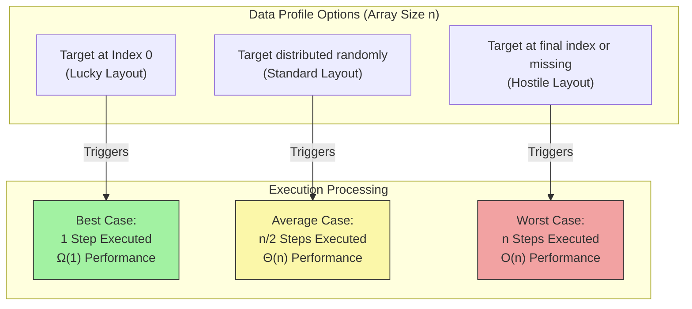

# Algorithm Analysis: Best, Average, and Worst Case

We have explored the mathematical notations—**Big O**, **Big $\Omega$**, and **Big $\Theta$**—used to wrap boundaries around our code. But why do these boundaries wiggle or change in the first place?

The variation doesn't happen because the code changes; it happens because the **arrangement of the incoming data** changes. To capture this reality, we analyze algorithms across three distinct structural horizons: **Best Case**, **Average Case**, and **Worst Case**.

### Why This Topic Exists

Data in the real world is unpredictable. Sometimes a user searches for an item that happens to be at the very beginning of a file, and sometimes it's missing entirely. Analyzing cases allows us to map out the entire performance profile of an algorithm, preventing us from being blinded by a lucky test run or blindsided by a production bottleneck.

### Why Programmers Need It

As a developer, if you only test your code using clean, perfectly ordered sample data, your software will look incredibly fast. But the moment real users interact with it, your system might slow to a crawl. Understanding these cases helps you build software that is resilient under stress.

### Why It Is Important Before Learning Advanced DSA and Machine Learning

In advanced DSA, choosing the right algorithm depends on knowing your data's characteristics. For instance, **QuickSort** is wildly popular because its average-case time complexity is a highly efficient $\Theta(n \log n)$. However, if you pass it data that is already perfectly sorted, its performance can degrade to a terrible $O(n^2)$ worst case! You must understand these variance profiles to choose safely.

---

# 1. Introduction

The practice of splitting algorithm performance into distinct cases was developed to give engineers a realistic, multi-dimensional view of system behavior.

### What Problem It Solves

If we only evaluated an algorithm based on one absolute metric, we would lose vital context. For example, if we classified a searching program solely by its best-case speed, it would seem perfect. If we classified it solely by its worst-case speed, it might seem unviable.

Analyzing best, average, and worst cases solves this by painting a complete picture of an algorithm's lifecycle, separating seasonal performance variations from systemic flaws.

### Where It Is Used in Software Engineering

* **Load Testing:** Stress-testing backend servers with worst-case data volumes to ensure the infrastructure doesn't collapse during peak sales traffic.
* **Database Optimization:** Designing queries that maintain a stable average-case runtime even as millions of random entries are added daily.

---

# 2. Build Intuition

Let’s step away from the computer and look at a real-world scenario: **Commuting to work via public transit.**

Imagine you take a public bus to your office every morning. Let's look at how your commute time varies based on external conditions:

* **The Best Case:** You walk up to the bus stop, and the bus is rolling to a stop right at that exact second. There is zero traffic, every light is green, and you cruise straight to your office in **15 minutes**.
* **The Worst Case:** You arrive at the stop right as a bus pulls away, forcing you to wait 30 minutes for the next one. Once on board, a severe storm hits, a minor accident blocks the main lane, and the commute stretches to **2 hours**.
* **The Average Case:** On a typical Tuesday, you wait about 5 minutes at the stop. There is normal, moving traffic with a few red lights. The journey takes **40 minutes**.

### How to Think About This Algorithmic Spectrum

* The **Best Case** matches your **Big $\Omega$ (Lower Bound)** threshold.
* The **Worst Case** matches your **Big O (Upper Bound)** threshold.
* The **Average Case** tells you what will happen **95% of the time** in production.

### Common Misconceptions & Beginner Confusion

* **The "Average Case" is NOT just the halfway point.** A common mistake is adding the best case and worst case together and dividing by two. In computer science, the average case is calculated using **probability**. We look at all possible permutations of data and calculate the mathematically expected value.
* **Focusing too much on the Best Case.** Beginners often write inefficient code and defend it by saying, *"But look how fast it finishes if the data is already sorted!"* In production engineering, we rarely design around the best-case scenario. We build systems to survive the worst case and run efficiently in the average case.

---

# 3. Core Theory

Let's ground these concepts in a concrete technical scenario using a standard **Linear Search** algorithm.

```python
def linear_search(arr, target):
    for i in range(len(arr)):
        if arr[i] == target:
            return i # Found item
    return -1 # Item missing

```

### 1. Best Case Analysis

* **Definition:** The scenario where the input data is arranged in the absolute most favorable configuration possible for the algorithm.
* **Technical Explanation:** For a linear search, the best-case scenario occurs when the `target` value is located at the very first index of the array (`arr[0]`).
* **Mathematical Step Count:** The loop executes exactly once, evaluates the condition, and returns.
* **Complexity Notation:** $\Omega(1)$ (Constant Time).

### 2. Worst Case Analysis

* **Definition:** The scenario where the input data is arranged in the absolute most hostile configuration possible, forcing the algorithm to do maximum work.
* **Technical Explanation:** For a linear search, the worst-case scenario occurs when the `target` value is at the very last index (`arr[n-1]`) or is completely missing from the array.
* **Mathematical Step Count:** The loop must run through all $n$ elements sequentially before terminating.
* **Complexity Notation:** $O(n)$ (Linear Time).

### 3. Average Case Analysis

* **Definition:** The behavior of the algorithm averaged over all possible valid input data permutations, weighted by their probability of occurring.
* **Technical Explanation:** Assuming the `target` value is present in the array and is equally likely to be at any index, we calculate the average number of steps.
* **Mathematical Intuition:** To find the average steps, we sum all possible step counts and divide by the total number of options ($n$):

$$\text{Average Steps} = \frac{1 + 2 + 3 + \dots + n}{n}$$


Using the standard arithmetic series formula, the sum of $1$ to $n$ is $\frac{n(n + 1)}{2}$. Substituting this back in gives:

$$\text{Average Steps} = \frac{\frac{n(n + 1)}{2}}{n} = \frac{n + 1}{2}$$


As $n$ grows to infinity, $\frac{n + 1}{2}$ behaves exactly like $\frac{1}{2}n$. Dropping the constant multiplier ($\frac{1}{2}$), the growth rate remains cleanly linear.
* **Complexity Notation:** $\Theta(n)$ (Linear Time).

---

# 4. Visual Learning

Let's look at how these three operational states look visually on a execution timeline.

### Diagram: The Performance Spectrum Matrix

This flow chart maps out how an incoming data block routes an algorithm into vastly different performance tiers based on layout properties.



### What We Learn From This Diagram

The exact same code block yields radically different operational footprints depending on the state of the data. The structural design of your loops controls the boundaries, but the input data chooses which pathway the system actually experiences.

---

# 5. Practical Examples

Let’s look at another classic algorithmic archetype to observe how runtime properties shift based on case scenarios: **The Early Break Duplicate Checker**.

### Code Implementation

* **Why this example was chosen:** It showcases an algorithm where the best-case floor and worst-case ceiling pull away from each other dramatically.
* **Intuition:** We are checking if an array contains any adjacent duplicate values. The moment we find a match, we stop early.

```python
def has_adjacent_duplicate(arr):
    n = len(arr)
    
    # Loop through adjacent elements up to the second to last item
    for i in range(n - 1):
        if arr[i] == arr[i + 1]:
            return True # Early exit trigger
            
    return False

```

### Case Metric Analysis

#### 1. Best Case Profile

* **Data Structure Trigger:** `arr = [5, 5, 12, 9, 21]` (The duplicates are at index 0 and 1).
* **Step Derivation:** The very first comparison evaluates to true (`arr[0] == arr[1]`). The code exits instantly.
* **Time Complexity:** $\Omega(1)$ (Constant Time).

#### 2. Worst Case Profile

* **Data Structure Trigger:** `arr = [1, 2, 3, 4, 5]` (No duplicates exist anywhere in the array).
* **Step Derivation:** The algorithm is forced to verify every single pair down the entire length of the list before it can confidently return `False`.
* **Time Complexity:** $O(n)$ (Linear Time).

#### 3. Average Case Profile

* **Data Structure Trigger:** Elements are randomly assigned. On average, if a duplicate exists, it will be found roughly halfway through the list.
* **Step Derivation:** The loop runs approximately $\frac{n}{2}$ times. Dropping constant coefficients, the growth curve tracks linearly.
* **Time Complexity:** $\Theta(n)$ (Linear Time).

---

# 6. Machine Learning & Production Connection

### Chaos Engineering at Netflix

At massive streaming platforms like Netflix, systems engineers design microservices around **Worst-Case guarantees**. They use a technique called Chaos Engineering (using tools like *Chaos Monkey*) to deliberately inject hostile data layouts, network latencies, and server failures into production environments.

By observing how the system behaves under simulated worst-case conditions, engineers can ensure that if a localized database lookup falls into its absolute slowest execution state, the overall user interface fallback logic gracefully switches to cached alternatives rather than throwing a spinning loading wheel or crashing the smart TV app.

---

# 7. Practice Problems

Analyze the best, average, and worst-case runtimes of the following logic:

### 1. Element Comparison Scanning

* **Difficulty:** Easy
* **Core Concept:** Evaluating runtime metrics when early exit structures are stripped out entirely.
* **Problem Link:** [LeetCode - Check If Two String Arrays are Equivalent](https://leetcode.com/problems/check-if-two-string-arrays-are-equivalent/) *(Analyze whether character array match sweeps exhibit case variances based on element positions).*

---

# 8. Interview Preparation

### Master Class Optimization Discussion

When an interviewer asks you about the performance of your code, a phenomenal way to structure your breakdown is the **Three-Prong Response**:

1. *"In the absolute best-case scenario where our target data matches our pointer immediately, this algorithm achieves a flat boundary of $\Omega(1)$."*
2. *"Under standard randomized production traffic, the mathematical probability yields an expected average-case execution scale of $\Theta(n)$."*
3. *"Finally, in the absolute worst-case scenario where the item is absent, our safety ceiling is firmly locked at $O(n)$."*

> **Common Interview Mistake:** Never assume the average case is identical to the worst case without explicitly thinking through the math. For many complex sorting and tree structures, the average case is vastly faster than the worst case!

---

# 9. Key Takeaways

### What We Learned

* An algorithm's runtime can fluctuate dramatically based on how the incoming data is structurally arranged.
* **Best Case ($\Omega$)** represents the most optimal scenario (e.g., finding a target item on the very first try).
* **Worst Case ($O$)** serves as an absolute computational ceiling, guaranteeing the system will never run slower than this threshold.
* **Average Case ($\Theta$)** reflects standard real-world execution paths calculated using statistical probability.

### Quick Case Spectrum Reference Table

| Algorithm Profile | Best-Case Boundary | Average-Case Boundary | Worst-Case Boundary |
| --- | --- | --- | --- |
| **Linear Search** | $\Omega(1)$ | $\Theta(n)$ | $O(n)$ |
| **Array Pair Printing** | $\Omega(n^2)$ | $\Theta(n^2)$ | $O(n^2)$ |
| **Early Break Duplicate Check** | $\Omega(1)$ | $\Theta(n)$ | $O(n)$ |

> *"Hoping for the best case while failing to plan for the worst case is the recipe for production disaster."* *~ Unknown Systems Architect*