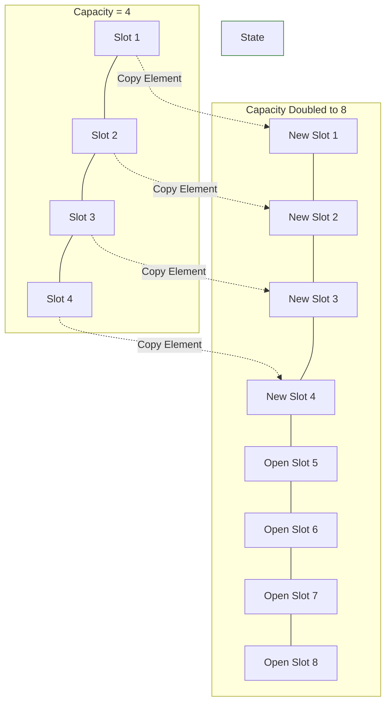

# Algorithm Analysis: Amortized Analysis

We have mastered how to look at an algorithm through the lenses of **Best**, **Average**, and **Worst Case**. In those chapters, we assumed that an algorithm performs a relatively uniform amount of work each time it is called.

But what happens when an algorithm runs blazingly fast 99% of the time, but occasionally—on very rare occasions—hits a massive roadblock that forces it to do a ton of heavy lifting? If we judge this algorithm strictly by its traditional worst-case ceiling, we would label it as highly inefficient. Yet, in production, it behaves beautifully almost every single day. To analyze this specific type of behavior accurately, computer scientists use **Amortized Analysis**.

### Why This Topic Exists

Amortized analysis exists to provide a more realistic, fair description of an algorithm's time complexity over a long sequence of operations. Instead of focusing heavily on a single, rare worst-case event, it averages out the cost of that rare expensive step over all the cheap steps that preceded or followed it.

### Why Programmers Need It

Many of the standard tools you use every single day—like Python’s dynamic lists (`list.append()`), Java’s `ArrayList`, or hash tables—rely completely on amortized performance guarantees. If you don't understand how amortized analysis works, you won't understand how modern programming languages manage memory behind the scenes, leading to poor architectural decisions when designing systems that handle steady streams of live data.

### Why It Is Important Before Learning Advanced DSA and Machine Learning

In advanced data structures like Disjoint Sets (Union-Find) or Splay Trees, individual operations can be quite expensive, but they structurally set up the data so that future operations become incredibly fast. Amortized analysis is the exact mathematical tool used to prove that these advanced systems are highly efficient when looked at as a continuous stream of work.

---

# 1. Introduction

The word *amortized* comes from the world of finance. If you buy a $300,000 house, you don't write a single massive check for $300,000 on day one and call it a day; instead, you break down that massive cost into predictable, manageable monthly mortgage payments over 30 years.

### What Problem It Solves

Traditional worst-case analysis is deeply pessimistic. If an operation takes $O(n)$ time just once in a thousand runs, traditional analysis slaps an "$O(n)$ Worst-Case" label on the entire function.

Amortized analysis solves this mathematical pessimism. It guarantees that if you run a sequence of $k$ operations, the total time for the *entire* sequence is small, even if a few individual operations were incredibly slow. It brings accounting logic into algorithmic performance.

### Where It Is Used in Software Engineering

* **Dynamic Arrays:** Appending items to an array that automatically expands its capacity when it runs out of space.
* **Database Writes:** Writing data to an in-memory cache that periodically pauses to flush all data down to the physical hard drive in one large batch.

---

# 2. Build Intuition

Let’s step out of the tech world and look at a real-life analogy: **Emptying the office trash can.**

Imagine you work in a cubicle. Every day, you generate a tiny bit of trash—a candy wrapper, a crumpled note, an empty soda can. Let's look at your daily "trash maintenance algorithm":

* **Days 1 through 6:** You toss your wrapper into the small trash can next to your desk. This takes exactly **1 second**. It is an incredibly cheap, fast operation.
* **Day 7:** You walk into your cubicle and realize your small trash can is completely full. You can't fit another thing inside it. You are now forced to pick up the heavy bin, walk all the way down the long hallway, dump it into the main building dumpster, and walk all the way back. This takes **60 seconds**.

If an observer evaluates your job efficiency *only* on Day 7, they will say, *"Wow, your trash routine is incredibly slow and inefficient!"* But is that fair? No. That 60-second cost only happened because you enjoyed 6 clean days of 1-second throws. If you average the total time spent over the entire week:


$$\text{Total Time} = 1 + 1 + 1 + 1 + 1 + 1 + 60 = 66 \text{ seconds}$$

$$\text{Amortized Cost per Day} = \frac{66 \text{ seconds}}{7 \text{ days}} \approx 9.4 \text{ seconds per day}$$

### How to Think About Amortization

The cheap operations "pay ahead" or save up credit, which is then spent to absorb the massive cost of the rare expensive operation. Even though the absolute worst-case scenario is 60 seconds, the **amortized cost** is a highly acceptable ~9 seconds per operation.

### Common Misconceptions

* **"Amortized Case is just Average Case."** * *Correction:* This is the number one point of confusion for beginners. Average case relies on **probability** and assumes the input data is random. Amortized analysis does *not* care about probability. Even if a malicious user provides the absolute worst data layout imaginable, amortized analysis guarantees that the average cost of a long sequence of steps remains small. It is a structural guarantee, not a statistical guess.

---

# 3. Core Theory: Dynamic Arrays

The absolute classic computer science example of amortized analysis is the **Dynamic Array** (like Python's `list`).

When you create an array, the computer allocates a fixed block of sequential memory slots. But what happens if you keep calling `.append()` to add elements, and you eventually run out of slots? The array cannot simply grow in place because another program might be using the adjacent memory cells.

### The Dynamic Array Scaling Algorithm

To append an element to a dynamic array, the system performs the following checks:

1. **If there is space available:** It places the item in the next empty slot. (Takes $1$ step).
2. **If the array is completely full:** * It allocates a brand-new, empty array that is **double the size** of the original one.
* It copies every single element from the old array into the new array ($n$ steps).
* It deletes the old array from memory.
* It appends the new element into the first open slot.


### Step-by-Step Sequence Tracing

Let's trace the exact computational steps executed as we append elements into an initially empty dynamic array of capacity 1:

* **Append 1:** Space available. Element placed. (Steps: **1**)
* **Append 2:** Array full! Allocate new array of size 2. Copy 1 element over, append item 2. (Steps: $1 \text{ copy} + 1 \text{ append} =$ **2**)
* **Append 3:** Array full! Allocate new array of size 4. Copy 2 elements over, append item 3. (Steps: $2 \text{ copies} + 1 \text{ append} =$ **3**)
* **Append 4:** Space available (slots 4 is open). Element placed. (Steps: **1**)
* **Append 5:** Array full! Allocate new array of size 8. Copy 4 elements over, append item 5. (Steps: $4 \text{ copies} + 1 \text{ append} =$ **5**)
* **Append 6, 7, 8:** Space available in slots 6, 7, and 8. Elements placed. (Steps: **1, 1, 1**)

### Mathematical Proof (The Aggregate Method)

Let's add up the total steps taken to insert a sequence of $n$ elements into the dynamic array.

Notice that every single item takes exactly 1 step for its base insertion. The extra work comes exclusively from copying elements when the array doubles. When does the array double? It doubles at powers of 2 ($1, 2, 4, 8, 16, \dots$).

For $n$ insertions, the total number of copying steps is:


$$\text{Total Copies} = 1 + 2 + 4 + 8 + \dots + \text{last power of 2} < 2n$$

Therefore, the total cost for inserting $n$ elements is the sum of the standard insertions ($n$ steps) plus the total copying steps (less than $2n$ steps):


$$\text{Total Steps } T(n) \le n + 2n = 3n$$

To find the **amortized cost per operation**, we divide the total steps by the number of operations ($n$):


$$\text{Amortized Cost} = \frac{3n}{n} = 3 \text{ steps}$$

Since $3$ is a constant number that does not grow as $n$ grows, we drop the coefficient. The amortized time complexity of a dynamic array append operation is **$O(1)$ (Constant Amortized Time)**.

---

# 4. Visual Learning

Let's look at how memory blocks expand and shift within your computer's RAM during a dynamic array resize event.

### Diagram: Dynamic Array Doubling Architecture

This process chart demonstrates how sequential memory slots copy and clear during an array expansion.



### What We Learn From This Diagram

* Modifying elements inside **State 1** becomes impossible once the local allocation boundary is crossed.
* In **State 2**, the system expends $O(n)$ linear energy to duplicate elements into an expanded layout. However, this large expenditure unlocks multiple wide-open empty slots, guaranteeing that the next sequence of operations can execute instantly in constant time.

---

# 5. Practical Examples

Let’s implement a basic simulation of a dynamic array tracking mechanism in Python to show how these steps manifest in logic.

```python
class SimulatedDynamicArray:
    def __init__(self):
        self.capacity = 1  # Start with room for 1 item
        self.size = 0      # Currently holds 0 items
        self.total_operations_cost = 0

    def append(self, element):
        current_cost = 0
        
        # Check if the internal memory array is completely full
        if self.size == self.capacity:
            print(f"--- Array Full at size {self.size}! Doubling capacity to {self.capacity * 2} ---")
            # Worst-case cost: we must copy all current elements
            current_cost += self.size 
            self.capacity *= 2
            
        # Standard cost: appending the item into the open slot takes 1 step
        current_cost += 1
        self.size += 1
        
        # Log metrics for analysis
        self.total_operations_cost += current_cost
        print(f"Appended {element}: Cost for this step = {current_cost}, Total Cumulative Cost = {self.total_operations_cost}")

# Testing our simulated structure over a sequence
array_stream = SimulatedDynamicArray()
for i in range(1, 9):
    array_stream.append(i)

```

#### Complexity Analysis of `.append()`

* **Worst-Case Time Complexity:** $O(n)$ for an individual call that triggers a capacity doubling block.
* **Amortized Time Complexity:** $O(1)$ over a continuous sequence of appending calls.
* **Space Complexity:** $O(n)$ to maintain the newly scaled element buffer space inside memory.

---

# 6. Machine Learning & Production Connection

### Streaming Log Buffers at Uber

In high-throughput logging frameworks—such as the streaming telemetry engines tracking live GPS coordinates for every vehicle on the Uber platform—writing data directly to a persistent database disk for every single coordinate point would create an immense hardware bottleneck. Disk operations are incredibly slow.

To maintain real-time performance, production engineers use memory buffer blocks. The incoming data coordinates are placed into a fast dynamic memory array at an amortized rate of **$O(1)$**.

Once that memory array hits capacity, a background worker thread takes the entire block, serializes it, and sends it to long-term storage in a single, massive batch disk write operation. Amortized analysis allows architects to guarantee a highly predictable, ultra-low latency data intake stream even under intense traffic conditions.

---

# 7. Practice Problems

### 1. Stack Simulation with Increment Trackers

* **Difficulty:** Medium
* **Core Concept:** Verifying how tracking arrays reset across multiple continuous command calls.
* **Problem Link:** [LeetCode - Design a Stack With Increment Operation](https://leetcode.com/problems/design-a-stack-with-increment-operation/) *(Analyze how lazy-propagation shifts operational costs to maintain amortized constant runtimes).*

---

# 8. Interview Preparation

### The Elite Distinction: Differentiating Worst-Case vs Amortized

A favorite trap for tech interviewers at companies like Google or Amazon is asking: *"What is the time complexity of appending an item to a dynamic array or list?"*

* **The Incomplete Answer:** *"It's $O(1)$."* (The interviewer will ask: *"Is it always $O(1)$? What happens when the array fills up?"*)
* **The Expert Answer:** *"The absolute worst-case time complexity for a single operation is $O(n)$ due to resizing allocations. However, when evaluated across a long sequence of insertions, the expensive operations occur so infrequently that the cost averages out, yielding an **amortized time complexity of $O(1)$**."*

---

# 9. Key Takeaways

### What We Learned

* **Amortized Analysis** evaluates the average time taken per operation over a long, continuous sequence of execution tasks.
* It ensures that a rare, highly expensive worst-case event does not unfairly penalize an algorithm that runs exceptionally fast almost all of the time.
* It differs fundamentally from Average Case because it requires absolutely no probabilistic assumptions about the input data structure layout.

### Dynamic Array Complexity Revisions

* **Single Element Append (No Resize):** $O(1)$ Peak Speed.
* **Single Element Append (With Resize):** $O(n)$ Worst-Case Spike.
* **Continuous Streaming Appends:** $O(1)$ Amortized Guarantee.

> *"Amortization proves that an occasional heavy investment can pave the way for a long run of effortless efficiency."* *~ Unknown Systems Architect*